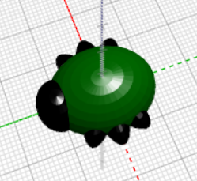

## اصنع الأرجل

الآن تحتاج الدعسوقة الى ستة أرجل!

--- task ---

أولاً ضع زوجًا من الساقين في منتصف جسم الحشرة.

انقر فوق `+` في الجزء العلوي من كتلة `union` لإضافة قسم آخر. أضف `sphere` لإنشاء زوج من الأرجل.

--- /task ---

--- task ---

إذا أردت، يمكنك تعطيل جسم الحشرة لترى كيف تصنع الأرجل.

ثم قم بتمكين الجسم مرة أخرى لمواصلة العمل على الدعسوقة.

--- /task ---

--- task ---

أضف الآن زوجًا آخر من الأرجل.

أضف `scaled` للـ `sphere` بنفس الإعدادات. ثم قم `بتدوير` بمقدار `30` على طول المحور Z بحيث تلتصق الأرجل بزاوية.

الآن لدى الدعسوقة ساقين في الوسط وساق أمامية واحدة وساق خلفية لكل منهما!

--- /task ---

--- task ---

هل يمكنك إضافة زوج ثالث من الأرجل بحيث يكون للحشرة ثلاث مجموعات كاملة من أزواج الأرجل؟

يجب أن يبدو شكل الدعسوقة الخاص بك كما يلي:

--- hints ---
 --- hint ---

`تحتاج إلى إضافة `المجال مقياس.

`دوّر`{:class="blockscadtransforms"} في الاتجاه المعاكس `للكرة` الثانية. هناك 360 درجة في الدائرة.

إليك الكتل التي تحتاجها:

--- /hint ---

--- hint ---

إليك الكود البرمجي الذي تحتاجه:

--- /hint ---

--- /hints --- --- /task ---