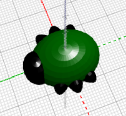

## Vytvořte nohy

Nyní chyba potřebuje šest nohou!

--- task ---

Nejprve vložte pár nohou doprostřed těla chyby.

Kliknutím na `+` v horní části bloku `unie` přidejte další sekci. Přidáním natažené `koule` vytvořte pár nohou.

--- /task ---

--- task ---

Pokud chcete, můžete zakázat tělo chyby a zjistit, jak se vytvářejí nohy.

Potom povolte tělu, aby pokračovalo v práci na vaší chybě.

--- /task ---

--- task ---

Nyní přidejte další pár nohou.

Přidejte další `koule` `koule` se stejným nastavením. Potom `otočte` o `30` postupným klesáním podél osy Z, takže nohy vyčnívají pod úhlem.

Nyní má vaše chyba dvě střední nohy a jednu přední a zadní nohu.

--- /task ---

--- task ---

Můžete přidat třetí pár nohou, aby chyba měla tři kompletní sady párů nohou?

Vaše chyba musí vypadat takto:

--- hints --- --- hint ---

Musíte přidat třetí `měřítko` `koule`.

`Otáčení`{: class = "blockscadtransforms"} ve směru proti druhému `koule`. V kruhu je 360 stupňů.

Zde jsou bloky, které potřebujete:

--- /hint ---

--- hint ---

Zde je kód, který potřebujete:

--- /hint ---

--- /hints --- --- /task ---