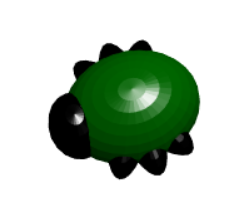

## Cyflwyniad

Yn y prosiect hwn, byddwch yn defnyddio BlocksCAD i ddylunio nam 3D neu bryfed gan ddefnyddio siapiau geometrig.

Os oes gennych argraffydd 3D, gallwch argraffu'r nam rydych chi'n ei ddylunio. Ar ôl i'ch byg gael ei argraffu, gallwch ychwanegu manylion gan ddefnyddio corlannau marcio parhaol.

Byddwch hefyd yn gallu defnyddio'r sgiliau rydych chi wedi'u dysgu i ddylunio'ch nam eich hun neu greadur arall gan ddefnyddio siapiau geometrig.

Mae'r chwilod yn gwneud gwobrau gwych am ddadfygio!

### Yr hyn byddi di'n ei greu

Mae'r byg gorffenedig yn edrych fel hyn:

Os oes gennych argraffydd 3D, gallwch argraffu eich nam ac yna ei addurno.

Dim ond mewn un lliw y gall y mwyafrif o argraffwyr 3D argraffu, felly gallwch ychwanegu manylion gan ddefnyddio marcwyr parhaol i wneud i'ch byg edrych hyd yn oed yn well.

--- collapse ---
---
title: Beth fydd ei angen arno ti
---

### Caledwedd

+ Argraffydd 3D, a ffilament mewn lliw o'ch dewis chi
+ Corlannau marciwr parhaol lliw mewn ystod o liwiau - mae lliwiau metelaidd yn gweithio'n dda

### Meddalwedd

+ Gellir cwblhau'r prosiect hwn mewn porwr gwe gan ddefnyddio BlocksCAD [bloccad3d.com/editor/](https://www.blockscad3d.com/editor){: target = "_ blank"}

--- /collapse ---

--- collapse ---
---
title: Yr hyn byddi di'n ei ddysgu
---

+ Modelu 3D gyda siapiau geometrig (sfferau)
+ Gan ddefnyddio `graddfa` i ymestyn siapiau geometig

--- /collapse ---

--- collapse ---
---
title: Gwybodaeth ychwanegol i addysgwyr
---

Os oes angen i chi argraffu y prosiect, defnyddiwch [fersiwn i'w argraffu](https://projects.raspberrypi.org/en/projects/blockscad-bug/print){:target="_blank"}.

Download the finished project code at [rpf.io/p/en/blockscad-bug-get](https://rpf.io/p/en/blockscad-bug-get).

--- /collapse ---
