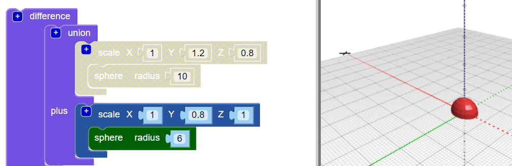
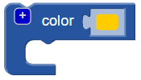

## Ychwanegwch ben at eich nam

Nawr crëwch ben ar gyfer y nam.

--- task ---

Ychwanegwch sffêr `llai` fel pen y nam. Ar hyn o bryd ni allwch weld y sffêr newydd hon, oherwydd ei fod wedi'i guddio y tu mewn i'r corff.

Hefyd ychwanegwch floc `graddfa` i'r `sffêr` newydd i siapio'r pen.

Yna ychwanegwch floc `undeb`{: class = "bloccadsetops"} i gyfuno'r pen a'r corff.

--- /task --- --- task ---

Os ydych chi am weld y sffêr `newydd`, yna analluoga'r corff dros dro trwy glicio ar y dde ar ei floc `scale`{: class = "bloccadcadiadau"} a dewis **Analluogi bloc**. Yna mae'r bloc hwn a'r rhai y tu mewn iddo yn llwydaidd, ac nid yw'r corff yn ymddangos pan fyddwch chi'n clicio **Rendr**.

De-gliciwch ar y bloc eto a dewis **Galluogi bloc** i alluogi'r corff.

--- /task --- --- task ---

`Cyfieithwch` y pen ar hyd yr echel Y fel ei fod yn glynu allan o'r corff.

  

--- /task --- --- task ---

Os ydych chi am weld y gwahanol siapiau yn glir, newidiwch liw'r pen.

Gallwch hefyd arbrofi gyda chyfuniadau lliw gwahanol ar gyfer addurno'ch nam print gyda marcwyr parhaol.

--- /task --- --- task ---

Allwch chi newid lliw corff eich model nam? Fe allech chi ei newid i liw'r ffilament rydych chi am ei argraffu ag ef, neu i liw'r marciwr parhaol rydych chi am ei liwio ag ef.

--- hints --- --- hint ---

Dyma'r bloc sydd ei angen arnoch chi.

--- /hint ---

--- hint ---

Dyma enghraifft gyda chorff gwyrdd:

--- /hint --- --- /hints --- --- /task ---

  
