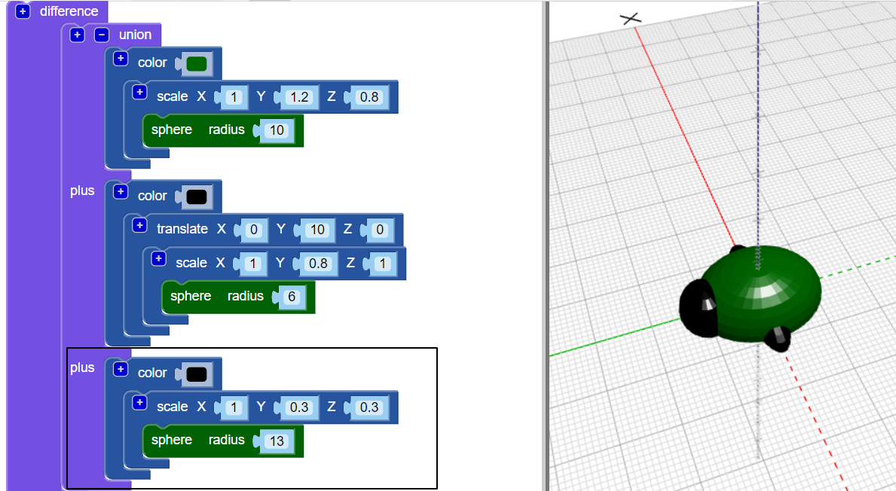

## Creu coesau

Nawr mae angen chwe choes ar y byg!

--- task ---

Yn gyntaf rhowch bâr o goesau yng nghanol corff y byg.

Cliciwch y `+` ar frig bloc `undeb` i ychwanegu adran arall. Ychwanegu ymestyn `sffêr` i greu pâr o goesau.

--- /task ---

--- task ---

Os dymunwch, gallwch analluogi corff y byg i weld sut mae'r coesau'n cael eu gwneud.

Yna galluogwch y corff eto i barhau i weithio ar eich nam.

--- /task ---

--- task ---

Nawr ychwanegwch bâr arall o goesau.

Ychwanegwch un arall `raddfa` `sffêr` gyda'r un lleoliadau. Yna `cylchdroi` mae'n `` degress ar hyd yr echel Z fel bod y coesau'n glynu allan ar ongl.

Nawr mae gan eich nam ddwy goes ganol ac un goes flaen a choes gefn yr un!

--- /task ---

--- task ---

A allwch chi ychwanegu trydydd pâr o goesau fel bod gan y byg dair set gyflawn o barau coesau?

Mae angen i'ch byg edrych fel hyn:

--- hints --- --- hint ---

Mae angen i chi ychwanegu traean `graddfa` `sffêr`.

`Cylchdroi`{: class = "bloccadcadiadau"} i'r cyfeiriad arall i'r ail `sffêr`. Mae 360 gradd mewn cylch.

Dyma'r blociau côd rwyt ti eu hangen:

--- /hint ---

--- hint ---

Dyma'r cod sydd ei angen arnoch chi:

--- /hint ---

--- /hints --- --- /task ---