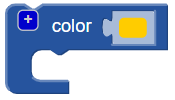

## Føj et hoved til din fejl

Opret nu et hoved til fejlen.

--- task ---

Tilføj en mindre `sfære` som bugens hoved. Lige nu kan du ikke se denne nye sfære, fordi den er skjult inde i kroppen.

Tilføj også en `skala` blok til den nye `sfære` at forme hovedet.

Tilføj derefter en `union`{: class = "blockscadsetops"} -blok for at kombinere hoved og krop.

--- /task --- --- task ---

Hvis du vil se den nye `sfære`, skal du midlertidigt deaktivere kroppen ved at højreklikke på dens `skala`{: class = "blockscadtransforms"} -blok og vælge **Deaktiver blok**. Derefter gråes denne blok og dem deri ind, og kroppen vises ikke, når du klikker på **Render**.

Højreklik på blokken igen og vælg **Aktivér blok** at aktivere kroppen.

--- /task --- --- task ---

`Oversæt` hovedet langs Y-aksen, så det stikker ud af kroppen.

  

--- /task --- --- task ---

Hvis du klart vil se de forskellige former, skal du ændre farven på hovedet.

Du kan også eksperimentere med forskellige farvekombinationer til dekoration af din trykte fejl med permanente markører.

--- /task --- --- task ---

Kan du ændre farven på kroppen på din bugmodel? Du kan ændre den til farven på glødetråden, du vil udskrive med, eller til farven på den permanente markør, du vil farve den med.

--- hints --- --- hint ---

Dette er den blok, du har brug for.

--- /hint ---

--- hint ---

Her er et eksempel med en grøn krop:

--- /hint --- --- /hints --- --- /task ---

  
