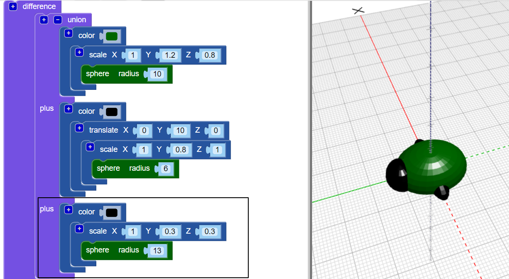

## Opret ben

Nu skal bugten have seks ben!

--- task ---

Sæt først et par ben midt i bugens krop.

Klik på `+` øverst i `union` blokken for at tilføje et andet afsnit. Tilføj en strakt `sfære` at skabe et par ben.

--- /task ---

--- task ---

Hvis du vil, kan du deaktivere bugten af bugten for at se, hvordan benene er lavet.

Aktivér derefter kroppen igen til at fortsætte med at arbejde på din bug.

--- /task ---

--- task ---

Tilføj nu et andet par ben.

Tilføj endnu `skaleret` `sfære` med de samme indstillinger. Drej derefter `` med `30` aftap langs Z-aksen, så benene stikker ud i en vinkel.

Nu har din bug to midterste ben og et forben og bagben hver!

--- /task ---

--- task ---

Kan du tilføje et tredje benpar, så bugten har tre komplette sæt benpar?

Din bug skal se sådan ud:

--- hints --- --- hint ---

Du skal tilføje et tredje `skaleret` `sfære`.

`Drej`{: class = "blockscadtransforms"} den i modsat retning fra den anden `sfære`. Der er 360 grader i en cirkel.

Her er de blokke, du har brug for:

--- /hint ---

--- hint ---

Her er den kode, du har brug for:

--- /hint ---

--- /hints --- --- /task ---