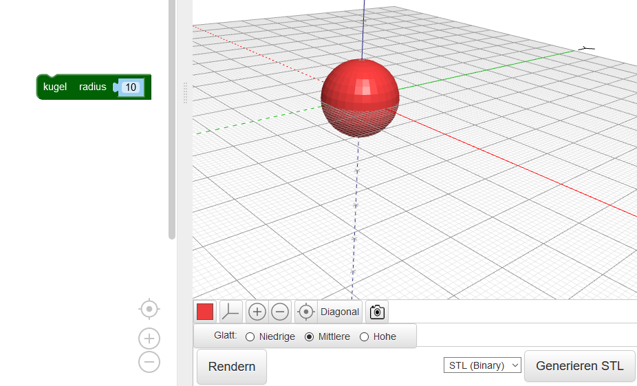
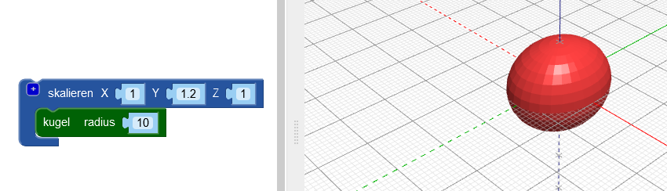
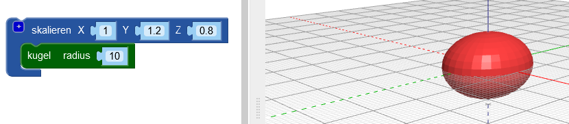

## Gib deinem Käfer einen Körper

--- task ---

Öffne den BlocksCAD-Editor in einem Webbrowser. [blockscad3d.com/editor/](https://www.blockscad3d.com/editor/){:target="_ blank"}

--- /task ---

Erstelle nun den Körper deines Käfers.

--- task ---

Beginne mit einer `Kugel` mit einem Radius von `10` (die Einheit hier ist Millimeter):

Klicke auf die Schaltfläche **Rendern**, um das Ergebnis anzuzeigen.

Tipp: Du kannst die Farbe des gerenderten Modells ändern, indem du auf das farbige Quadrat klickst.

--- /task --- --- task ---

Dehne nun die Kugel entlang ihrer Y-Achse, um einen länglichen Körper für den Käfer zu erstellen.

Mit dem Block `skalieren`{:class="blockscadtransforms"} kannst du Objekte entlang der X-, Y- und Z-Achse strecken oder quetschen. Setze den Y-Wert auf `1.2`, um die Kugel entlang der Y-Achse zu dehnen.

Klicke erneut auf **Rendern** und überprüfe, ob die Kugel zu einem Ellipsoid gedehnt wurde. Betrachte dein Modell aus verschiedenen Blickwinkeln, damit du sehen kannst, wie es sich verändert hat.

--- /task ---

Tipp: Jedes Mal, wenn du den Code änderst, musst du auf **Rendern** klicken, um die Ergebnisse anzuzeigen.

--- task ---

Drücke nun das Ellipsoid etwas entlang der Z-Achse zusammen, um einen flacheren Käfer zu erzeugen.

Setzt du einen Achsenwert unter `1`, wird das Objekt entlag dieser Achse kleiner. Ändere daher den Z-Wert im `skalieren`{:class="blockscadtransforms"} Block auf `0.8`.

--- /task ---

