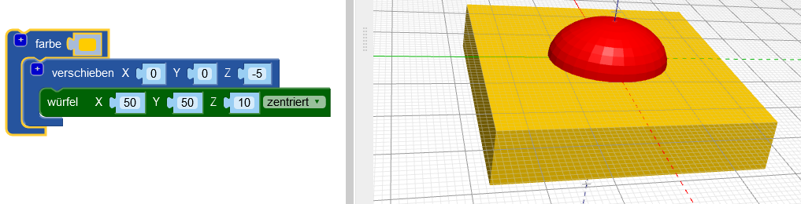
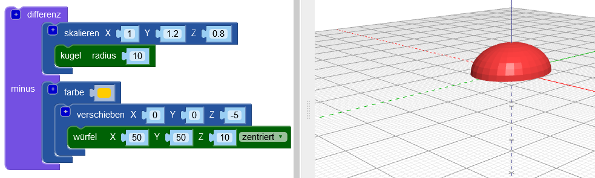

## Die Basis des Körpers abflachen

Glätte jetzt die Basis des Körpers, um deinen Käfer realistischer zu machen. Ein Modell mit einer flachen Basis ist auch einfacher in 3D zu drucken!

Dazu kannst du einfach einen Quader aus deinem Modell entfernen, indem du den `Differenz`{:class="blockscadsetops"} Block verwendest.

--- task ---

Erstelle zunächst einen Quader, der die untere Hälfte des Käfers abdeckt (der Teil, der auf der Z-Achse unter 0 liegt).

Der Quader sollte `zentriert` und 10 mm hoch sein (entlang der Z-Achse).

Füge einen `verschieben` Block hinzu, um den Quader -5mm entlang der Z-Achse (nach unten) zu bewegen.

Füge einen `farbe` Block hinzu, um dem Quader eine andere Farbe zu geben, damit kannst du den Körper deines Käfers und den Quader leichter voneinander unterscheiden.

Der Quader ist größer als der Körper des Käfers. Das bedeutet, dass du den Käfer noch ergänzen kannst, ohne den Quader später vergrößern zu müssen.

--- /task ---

--- task ---

Verwende einen `Differenz`{:class="blockscadsetops"} Block, um den Quader aus dem Körper zu entfernen.

Jetzt hat der Körper deines Käfers eine flache Basis!

Ziehe dein Modell im Betrachter umher, um es aus verschiedenen Blickwinkeln zu sehen.

--- /task ---

  
