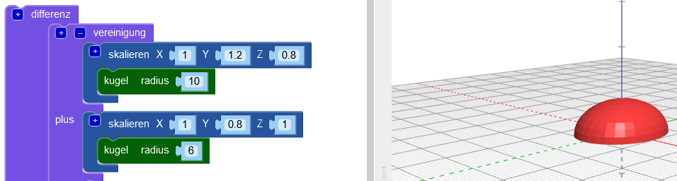
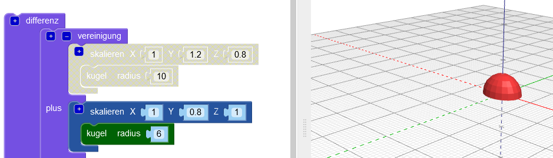
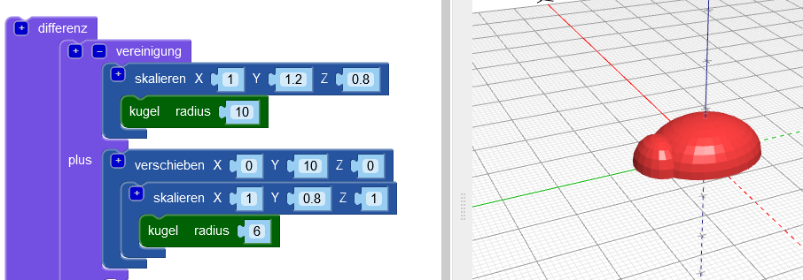
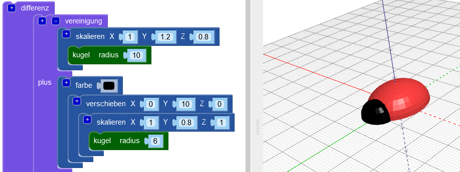
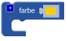
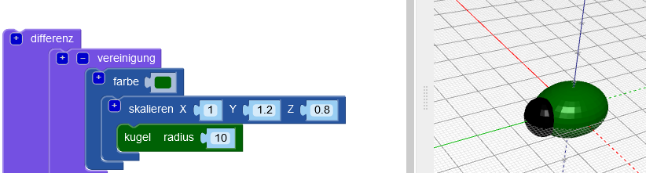

## Füge deinem Käfer einen Kopf hinzu

Erstelle nun einen Kopf für den Käfer.

--- task ---

Füge eine kleinere `Kugel` als Kopf für den Käfer hinzu. Im Moment kannst du diese neue Kugel nicht sehen, weil sie im Körper versteckt ist.

Füge der neuen `Kugel` auch einen `skalieren` Block hinzu, um den Kopf zu formen.

Füge dann einen `vereinigung`{:class="blockscadsetops"} Block hinzu, um Kopf und Körper zu kombinieren.

--- /task --- --- task ---

Wenn du die neue `Kugel` sehen willst, dann deaktiviere den Körper vorübergehend, indem du mit der rechten Maustaste auf seinen `skalieren`{:class=„blockscadtransforms“} Block klickst und **Baustein deaktivieren** auswählst. Dann sind dieser Block und die darin enthaltenen ausgegraut und der Körper wird nicht angezeigt, wenn du auf **Rendern** klickst.

Klicke erneut mit der rechten Maustaste auf den Block und wähle **Baustein aktivieren**, um den Körper zu aktivieren.

--- /task --- --- task ---

`Verschiebe` den Kopf entlang der Y-Achse so, dass er aus dem Körper herausragt.

  

--- /task --- --- task ---

Wenn du die verschiedenen Formen deutlich sehen möchtest, ändere die Farbe des Kopfes.

Du kannst auch mit verschiedenen Farbkombinationen experimentieren, um deinen gedruckten Käfer mit Permanentmarkern zu dekorieren.

--- /task --- --- task ---

Kannst du die Farbe des Körpers deines Käfer-Modells ändern? Du könntest sie zur Farbe des Filaments ändern, mit dem du drucken möchtest oder zur Farbe des Permanentmarkers, mit dem du es färben möchtest.

--- hints --- --- hint ---

Dies ist der Block, den du benötigst.

--- /hint ---

--- hint ---

Hier ist ein Beispiel mit einem grünen Körper:

--- /hint --- --- /hints --- --- /task ---

  
