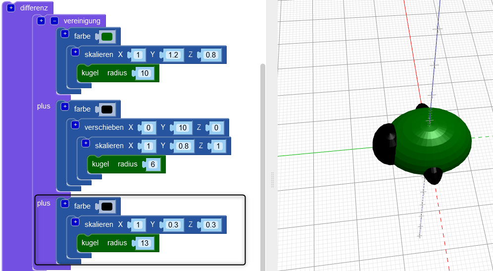
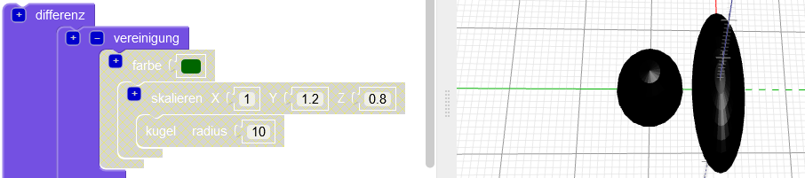
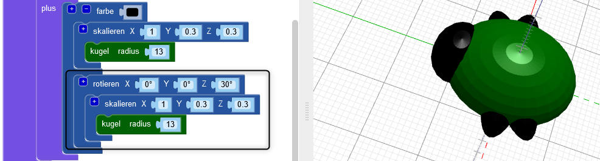
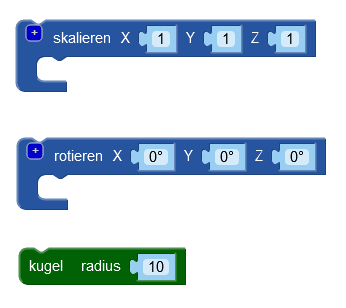
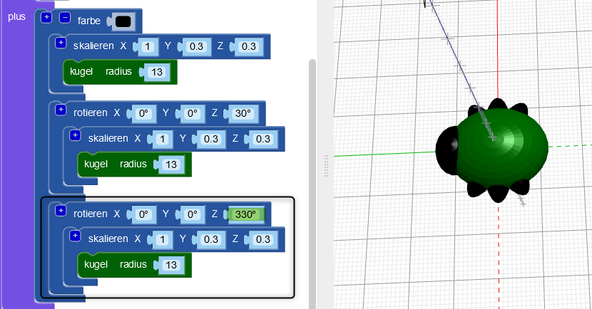

## Erstelle Beine

Jetzt braucht der Käfer sechs Beine!

--- task ---

Platziere zuerst ein Beinpaar in die Mitte des Körpers des Käfers.

Klicke oben im `vereinigungs` Block auf `+`, um einen weiteren Abschnitt hinzuzufügen. Füge eine gestreckte `Kugel` hinzu, um ein Beinpaar zu erstellen.

--- /task ---

--- task ---

Wenn du möchtest, kannst du den Körper des Käfers deaktivieren, um zu sehen, wie die Beine erstellt werden.

Aktiviere dann den Körper wieder, um weiter an deinem Käfer zu arbeiten.

--- /task ---

--- task ---

Füge nun ein weiteres Paar Beine hinzu.

Füge eine weitere `skalierte` `Kugel` mit denselben Einstellungen hinzu. Dann `rotiere` sie um `30` Grad entlang der Z-Achse, so dass die Beine schräg herausragen.

Jetzt hat dein Käfer zwei Mittelbeine und je ein Vorder- und Hinterbein!

--- /task ---

--- task ---

Kannst du ein drittes Beinpaar hinzufügen, sodass der Käfer drei vollständige Beinpaare hat?

Dein Käfer muss folgendermaßen aussehen:

--- hints --- --- hint ---

Du musst eine dritte `skalierte` `Kugel`hinzufügen.

`Rotiere`{:class="blockscadtransforms"} sie in die entgegengesetzte Richtung der zweiten `Kugel`. Es gibt 360 Grad in einem Kreis.

Hier sind die Blöcke, die du brauchst:

--- /hint ---

--- hint ---

Hier ist der Code, den du brauchst:

--- /hint ---

--- /hints --- --- /task ---