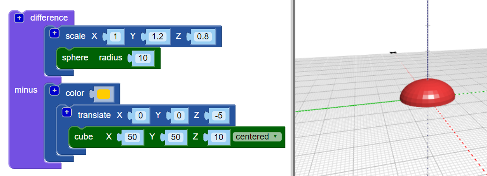

## Κάνε επίπεδη τη βάση του σώματος

Τώρα ίσιωσε τη βάση του σώματος για να κάνεις το έντομο πιο ρεαλιστικό. Ένα μοντέλο με επίπεδη βάση είναι επίσης ευκολότερο στην τρισδιάστατη εκτύπωση!

Για να γίνει αυτό, μπορείς απλά να αφαιρέσεις ένα κύβο από το μοντέλο σου χρησιμοποιώντας το μπλοκ `διαφορά`{:class="blockscadsetops"}.

--- task ---

Για να ξεκινήσεις, δημιούργησε ένα κύβο για να καλύψεις το κάτω μισό του εντόμου (το τμήμα που βρίσκεται κάτω από το 0 στον άξονα Z).

Ο κύβος θα πρέπει να είναι `κεντραρισμένος` με 10 χιλιοστά ύψος (κατά μήκος του άξονα Ζ).

Πρόσθεσε ένα μπλοκ `μετατροπή` για να κινήσεις τον κύβο -5 χιλιοστά κατά μήκος του άξονα Ζ (κάτω).

Για να είναι εύκολο να πει ξεχωρίσεις τον κύβο από το σώμα του εντόμου σου, πρόσθεσε ένα μπλοκ `χρώματος` για να κάνεις τον κύβο διαφορετικό χρώμα.

Ο κύβος είναι μεγαλύτερος από το σώμα του εντόμου. Αυτό σημαίνει ότι μπορείς να προσθέσεις στο έντομο χωρίς να χρειαστεί να κάνεις τον κύβο μεγαλύτερο αργότερα.

--- /task ---

--- task ---

Χρησιμοποίησε ένα μπλοκ `διαφορά`{:class="blockcadsetops"} για να αφαιρέσεις τον κύβο από το σώμα.

Τώρα το σώμα του εντόμου έχει μια επίπεδη βάση!

Σύρε το μοντέλο σου γύρω από τον θεατή για να το δεις από διάφορες γωνίες.

--- /task ---

  
