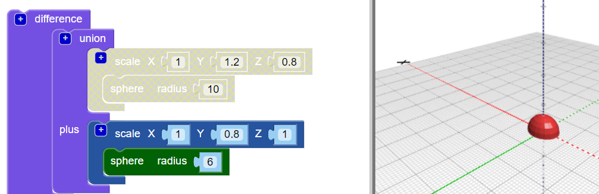

## Πρόσθεσε ένα κεφάλι στο έντομό σου

Τώρα δημιούργησε ένα κεφάλι για το έντομο.

--- task ---

Πρόσθεσε μια μικρότερη `σφαίρα` ως κεφάλι του εντόμου. Δεν μπορείς να δεις αυτή τη στιγμή τη νέα σφαίρα, επειδή είναι κρυμμένη μέσα στο σώμα.

Επίσης πρόσθεσε ένα μπλοκ `κλίμακας` στη νέα `σφαίρα` για να διαμορφώσεις το κεφάλι.

Στη συνέχεια πρόσθεσε ένα μπλοκ `ένωσης`{:class="blockscadsetops"} για να συνδυάσεις το κεφάλι και το σώμα.

--- /task --- --- task ---

Αν θέλεις να δεις τη νέα `σφαίρα`, απενεργοποίησε προσωρινά το σώμα κάνοντας δεξί κλικ στο μπλοκ της `κλίμακας`{:class="blockscadtransforms"} και επέλεξε **Απενεργοποίηση μπλοκ**. Στη συνέχεια, αυτό το μπλοκ και εκείνα μέσα του γίνονται γκρίζα, και το σώμα δεν εμφανίζεται όταν κάνεις κλικ στο **Απόδοση**.

Κάνε δεξί κλικ στο μπλοκ ξανά και επέλεξε **Ενεργοποίηση μπλοκ** για να ενεργοποιήσεις το σώμα.

--- /task --- --- task ---

`Μετακίνησε` το κεφάλι κατά μήκος του άξονα Υ έτσι ώστε να ξεφύγει από το σώμα.

  

--- /task --- --- task ---

Εάν θέλεις να δεις ξεκάθαρα τα διαφορετικά σχήματα, άλλαξε το χρώμα του κεφαλιού.

Μπορείς επίσης να πειραματιστείς με διαφορετικούς συνδυασμούς χρωμάτων για τη διακόσμηση του τυπωμένου εντόμου με μόνιμους μαρκαδόρους.

--- /task --- --- task ---

Μπορείς να αλλάξεις το χρώμα του σώματος του μοντέλου του εντόμου σου; Μπορείς να το αλλάξεις στο χρώμα του νήματος με το οποίο θέλεις να εκτυπώσεις ή στο χρώμα του μόνιμου μαρκαδόρου με τον οποίο θέλεις να το χρωματίσεις.

--- hints ---
 --- hint ---

Αυτό είναι το μπλοκ που χρειάζεσαι.

--- /hint ---

--- hint ---

Ακολουθεί ένα παράδειγμα με ένα πράσινο σώμα:

--- /hint ------ /hints --- --- /task ---

  
