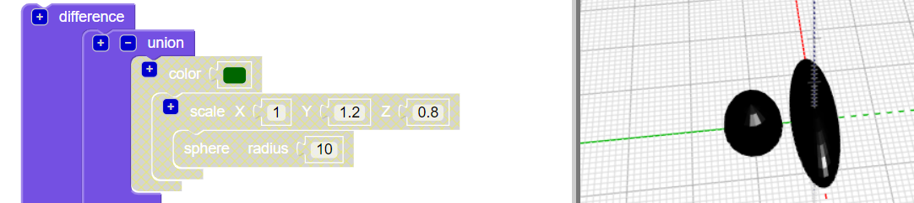

## Δημιούργησε πόδια

Τώρα το έντομο χρειάζεται έξι πόδια!

--- task ---

Τοποθέτησε πρώτα ένα ζευγάρι πόδια στο μέσο του σώματος του εντόμου.

Κάνε κλικ στο `+` στο επάνω μέρος του μπλοκ `ένωση` για να προσθέσεις άλλη μια ενότητα. Πρόσθεσε μια τεντωμένη `σφαίρα` για να δημιουργήσεις ένα ζευγάρι ποδιών.

--- /task ---

--- task ---

Αν θέλεις, μπορείς να απενεργοποιήσεις το σώμα του εντόμου για να δεις πως γίνονται τα πόδια.

Στη συνέχεια, ενεργοποίησε ξανά το σώμα για να συνεχίσεις να εργάζεσαι στο έντομό σου.

--- /task ---

--- task ---

Τώρα πρόσθεσε ένα άλλο ζευγάρι των ποδιών.

Πρόσθεσε μια άλλη `κλιμακωτή` `σφαίρα` με τις ίδιες ρυθμίσεις. Στη συνέχεια, `περίστρεψέ` την κατά `30` μοίρες κατά μήκος του άξονα Ζ, έτσι ώστε τα πόδια να εξέλθουν υπό γωνία.

Τώρα το έντομο έχει δύο μεσαία πόδια και ένα μπροστινό και πίσω πόδι έκαστο!

--- /task ---

--- task ---

Μπορείς να προσθέσεις ένα τρίτο ζεύγος ποδιών έτσι ώστε το έντομο να έχει τρία πλήρη σύνολα ζευγών ποδιών;

Το έντομό σου πρέπει να φαίνεται ως εξής:

--- hints --- --- hint ---

Θα πρέπει να προσθέσεις μια τρίτο `κλιμακωτή` `σφαίρα`.

`Περίστρεψέ`{:class="blockscadtransforms"} την προς την αντίθετη κατεύθυνση από τη δεύτερη `σφαίρα`. Υπάρχουν 360 μοίρες σε έναν κύκλο.

Εδώ είναι τα μπλοκ που χρειάζεσαι:

--- /hint ---

--- hint ---

Εδώ είναι ο κώδικας που χρειάζεσαι:

--- /hint ---

--- /hints --- --- /task ---