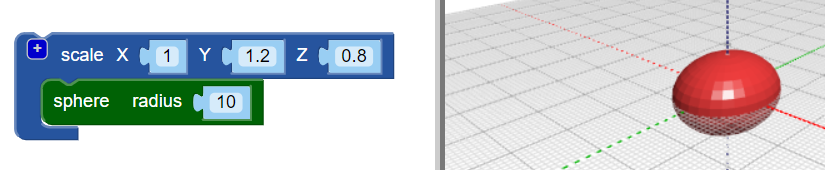

## Give the bug a body

--- task ---

Open the BlocksCAD editor in a web browser [blockscad3d.com/editor/](https://www.blockscad3d.com/editor/){:target="_blank"}

--- /task ---

Let's create the body of the bug. 

--- task ---
Start with a sphere with a diameter of 10mm (1cm):

Click `Render` to see the result. 

Tip: You can change the colour of the rendered model by clicking on the coloured square.
--- /task ---
--- task ---
Now let's stretch the sphere along the Y axis to give the bug an elongated body. 

`if`{:class="block3control"}

The `scale`{:class="blockscadtransforms"} block allows you to stretch or squash objects in the X, Y and Z directions. Set the Y value to 1.2 to stretch the sphere along the Y-axis. 

Click `Render` and notice that the sphere has been stretched into an ellipsoid. Try looking at your model from different angles so you can see how it has changed. 

--- /task ---
--- task ---
Now let's squish the bug a bit along the z-axis to make it flatter. 

Change the Z value in the `scale`{:class="blockscadtransforms"} block to 0.8. Values less than zero make the object smaller in that dimension.

--- /task ---

