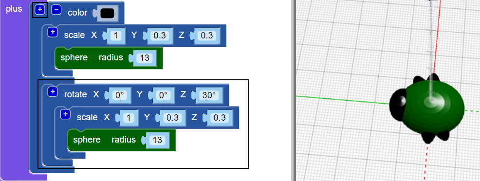

## Create legs

Now the bug needs six legs!

--- task ---
First put a pair of legs in the middle of the bug's body.  

Click the `+` at the top of the `union` block to add another section. Add a stretched `sphere` to create a pair of legs. 

--- /task ---

--- task ---

If you like, you can disable the body of the bug to see how the legs are made. 

Then enable the body again to continue working on your bug. 

--- /task ---

--- task ---
Now add another pair of legs.

Add another `scaled` `sphere` with the same settings. Then `rotate` it by `30` degress along the Z axis so the legs stick out at an angle.

Now your bug has two middle legs and one front leg and back leg each!

--- /task ---

--- task ---

Can you add a third pair of legs so that the bug has three complete sets of leg pairs? 

Your bug needs to look like this:

--- hints ---
--- hint ---
You need to add a third `scaled` `sphere`.

`Rotate`{:class="blockscadtransforms"} it in the opposite direction to the second `sphere`. There are 360 degrees in a circle.

Here are the blocks you need:

--- /hint ---

--- hint ---

Here's the code you need:

--- /hint ---

--- /hints ---
--- /task ---