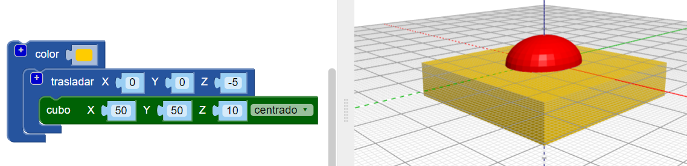
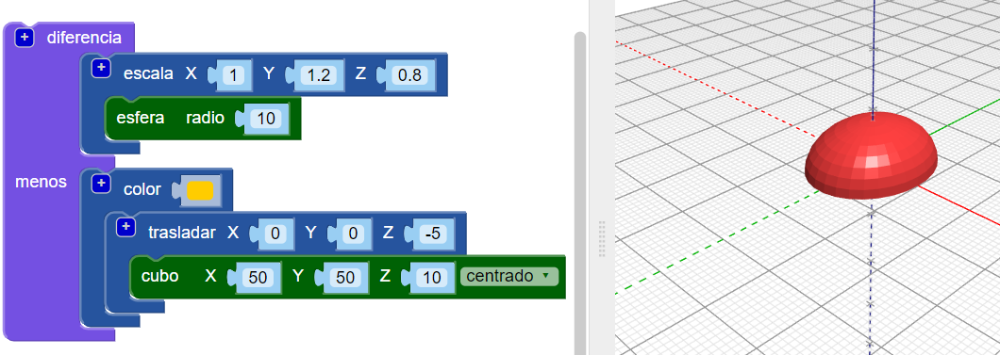

## Aplana la base del cuerpo

Ahora aplana la base del cuerpo para hacer que tu insecto sea más realista. ¡Un modelo con una base plana también es más fácil de imprimir en 3D!

Para hacer esto, simplemente puedes eliminar un cuboide de tu modelo utilizando el bloque `diferencia`{:class="blockscadsetops"}.

--- task ---

Para comenzar, crea un cuboide para cubrir la mitad inferior del insecto (la parte que se encuentra debajo de 0 en el eje Z).

El cuboide debe estar `centrado` y tener 10 mm de alto (a lo largo del eje Z).

Añade un bloque `trasladar` para mover el cuboide -5 mm a lo largo del eje Z (hacia abajo).

Para que sea fácil distinguir el cuboide y el cuerpo de tu insecto, añade un bloque `color` para que el cuboide tenga un color diferente.

El cuboide es más grande que el cuerpo del insecto. Esto significa que podrás añadir mas partes al insecto sin necesidad de agrandar el cuboide más adelante.

--- /task ---

--- task ---

Usa un bloque `diferencia`{:class="blockscadsetops"} para eliminar el cuboide del cuerpo.

¡Ahora el cuerpo de tu insecto tiene una base plana!

Arrastra tu modelo en el visor para verlo desde diferentes ángulos.

--- /task ---

  
