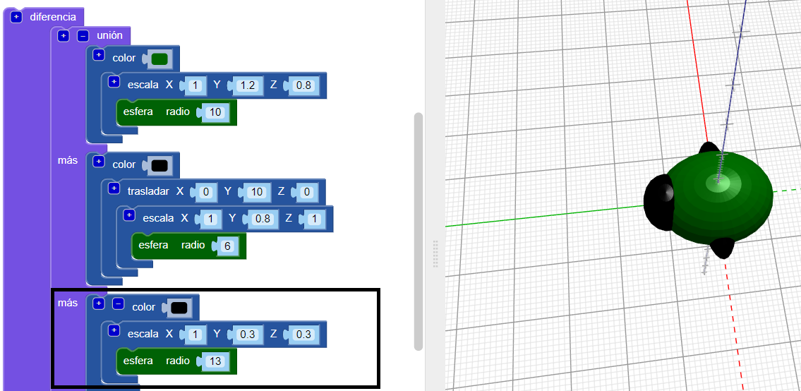
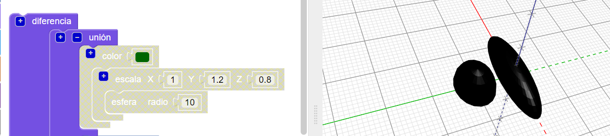
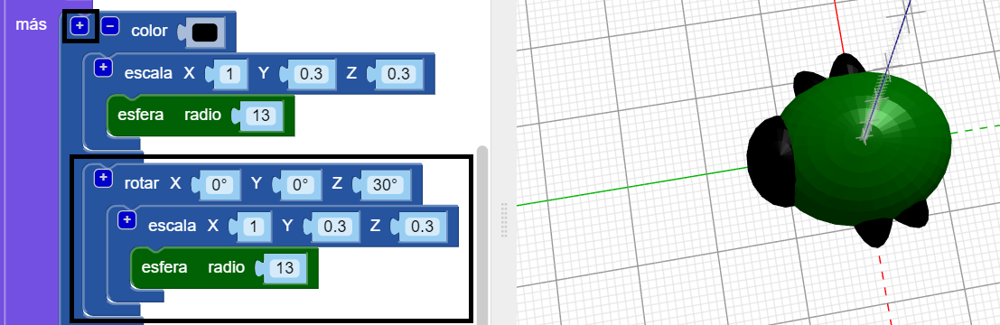
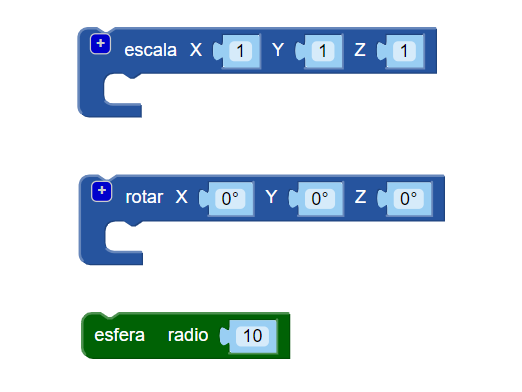
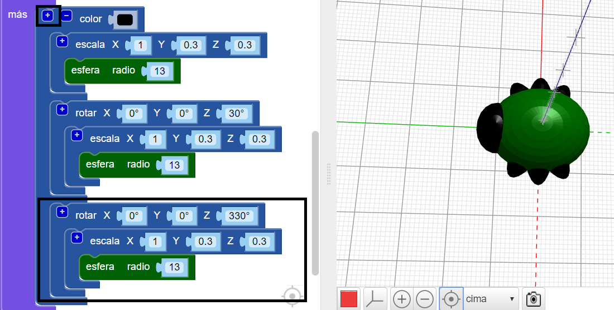

## Crea las patas

¡Ahora el insecto necesita seis patas!

--- task ---

Primero pon un par de patas en el medio del cuerpo del insecto.

Haz clic en `+` en la parte superior del bloque `union` para añadir otra sección. Añade una `esfera` alargada para crear un par de patas.

--- /task ---

--- task ---

Si lo deseas, puedes desactivar el cuerpo del insecto para ver cómo se hacen las patas.

Luego habilita el cuerpo nuevamente para continuar trabajando en tu insecto.

--- /task ---

--- task ---

Ahora añade otro par de patas.

Añade otro bloque `escala` y `esfera` con la misma configuración. Luego `gíralo` `30` grados a lo largo del eje Z para que las patas sobresalgan en ángulo.

¡Ahora tu insecto tiene dos patas centrales y una sola pata delantera y otra trasera!

--- /task ---

--- task ---

¿Puedes agregar un tercer par de patas para que el insecto tenga tres juegos completos de pares de patas?

Tu insecto debe verse así:

--- hints --- --- hint ---

Necesitas añadir un tercer bloque `escala` y `esfera`.

`Gíralo`{:class="blockscadtransforms"} en la dirección opuesta a la segunda `esfera`. Hay 360 grados en un círculo.

Aquí están los bloques que necesitas:

--- /hint ---

--- hint ---

Aquí está el código que necesitas:

--- /hint ---

--- /hints --- --- /task ---