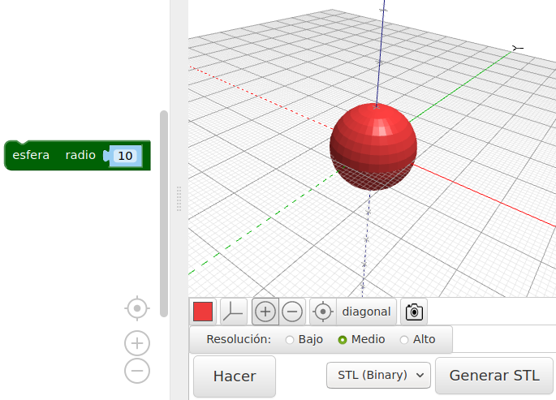
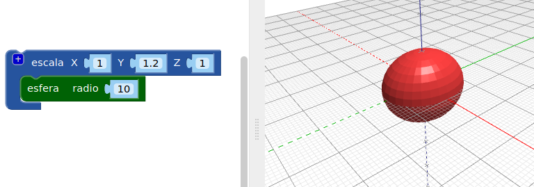
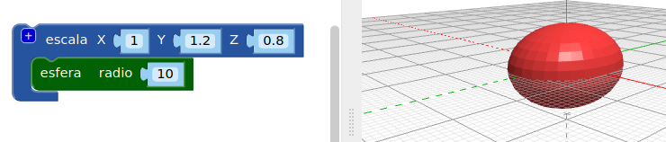

## Dale cuerpo a tu insecto

--- task ---

Abre el editor BlocksCAD en un navegador web [blockscad3d.com/editor/](https://www.blockscad3d.com/editor/){:target="_blank"}

--- /task ---

Ahora crea el cuerpo de tu insecto.

--- task ---

Comienza con una `esfera` con un radio de `10` (la unidad de medida usada son milímetros):

Haz clic en el botón **Hacer** para ver el resultado.

Consejo: puedes cambiar el color del modelo que has creado haciendo clic en el cuadrado coloreado.

--- /task --- --- task ---

Ahora estira la esfera a lo largo de su eje Y para crear un cuerpo alargado para el insecto.

El bloque `escala`{:class="blockscadtransforms"} te permite estirar o aplastar objetos a lo largo de los ejes X, Y y Z. Establezce el valor Y en `1.2` para estirar la esfera a lo largo del eje Y.

Haz clic en **Hacer** nuevamente y verifica que la esfera se haya estirado en un elipsoide. Mira tu modelo desde diferentes ángulos para que puedas ver cómo ha cambiado.

--- /task ---

Consejo: cada vez que realices un cambio en el código, debes hacer clic en **Hacer** para ver los resultados.

--- task ---

Ahora aplasta el elipsoide un poco a lo largo del eje z para hacer un insecto más plano.

Establecer un valor de eje por debajo de `1` hace que el objeto sea más pequeño a lo largo de ese eje. Así que cambia el valor Z en el bloque `escala`{:class="blockscadtransforms"} a `0.8`.

--- /task ---

