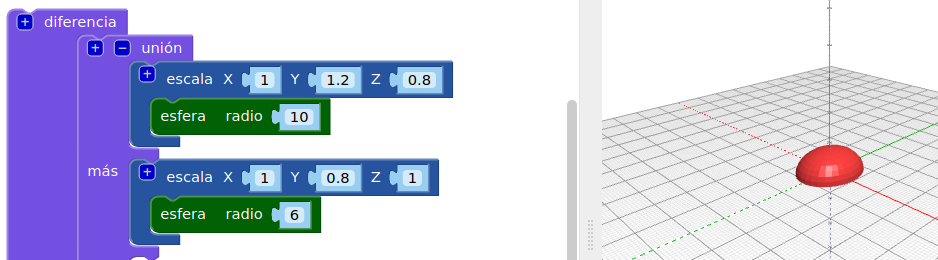
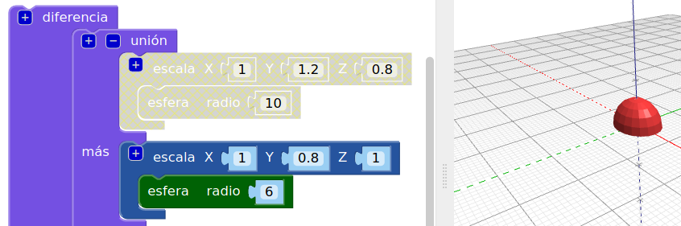
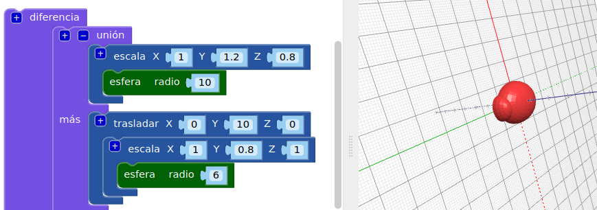
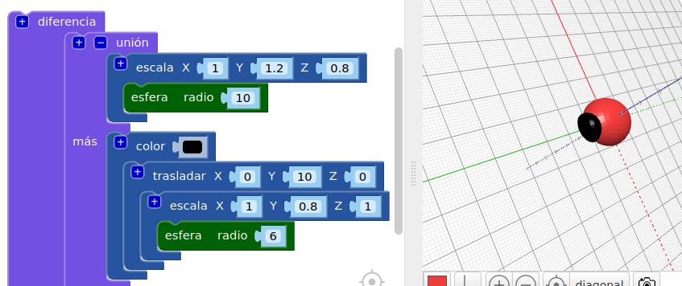
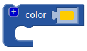
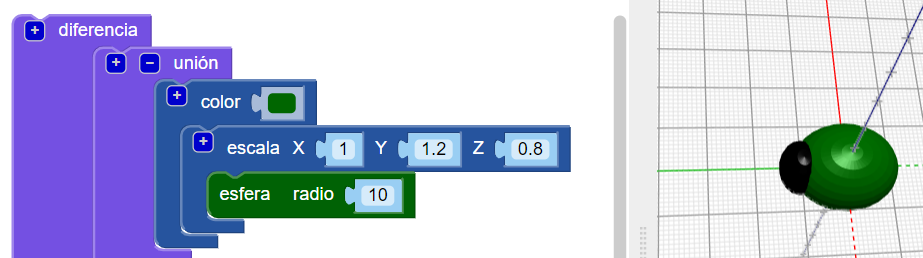

## Añade una cabeza a tu insecto

Ahora crea una cabeza para el insecto.

--- task ---

Añade una `esfera` más pequeña para que sea la cabeza del insecto. Ahora no puedes ver esta nueva esfera, porque está oculta dentro del cuerpo.

Añade también un bloque `escala` a la nueva `esfera` para dar forma a la cabeza.

Luego añade un bloque `union`{:class="blockscadsetops"} para unir la cabeza y el cuerpo.

--- /task --- --- task ---

Si deseas ver la nueva `esfera`, deshabilita temporalmente el cuerpo haciendo clic con el botón derecho en su bloque `escala`{:class="blockscadtransforms"} y selecciona **Desactivar bloque**. Así que este bloque y los que están dentro de él aparecerán en gris, y el cuerpo no se verá cuando hagas clic en **Hacer**.

Haz clic derecho en el bloque nuevamente y selecciona **Activar bloque** para habilitar el cuerpo.

--- /task --- --- task ---

`Traslada` la cabeza a lo largo del eje Y para que sobresalga del cuerpo.

  

--- /task --- --- task ---

Si deseas ver claramente las diferentes formas, cambia el color de la cabeza.

También puedes experimentar con diferentes combinaciones de colores para decorar tu insecto con marcadores permanentes una vez impreso.

--- /task --- --- task ---

¿Puedes cambiar el color del cuerpo de tu modelo de insecto? Puedes cambiarlo al color del filamento con el que deseas imprimir, o al color del marcador permanente con el que deseas colorearlo.

--- hints --- --- hint ---

Este es el bloque que necesitas.

--- /hint ---

--- hint ---

Aquí hay un ejemplo con un cuerpo verde:

--- /hint --- --- /hints --- --- /task ---

  
