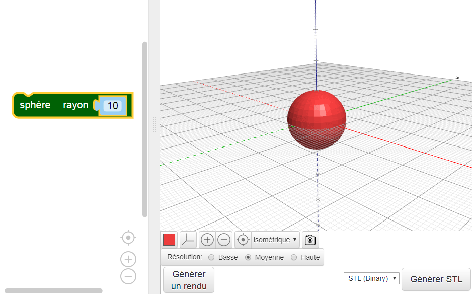
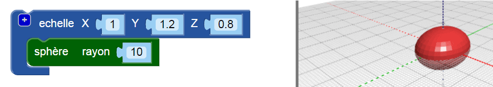

## Donne un corps à ton insecte

--- task ---

Ouvre l'éditeur BlocksCAD dans un navigateur Web [blockscad3d.com/editor/](https://www.blockscad3d.com/editor/){:target="_blank"}

--- /task ---

Crée maintenant le corps de ton insecte.

--- task ---

Commence avec une `sphère`avec un rayon de`10` (l'unité est ici en millimètres) :

Clique sur le bouton **Rendu** pour voir le résultat.

Astuce : tu peux changer la couleur du modèle rendu en cliquant sur le carré coloré.

--- /task --- --- task ---

Maintenant, étire la sphère le long de son axe Y pour allonger l'insecte.

Le bloc `échelle`{:class="blockscadtransforms"} te permet d'étirer ou d'écraser des objets le long des axes X, Y et Z. Définis la valeur Y sur `1,2` pour étirer la sphère le long de l'axe Y.

Clique à nouveau sur **Rendu** et vérifie que la sphère a été étirée en ellipsoïde. Regarde ton modèle sous différents angles pour voir comment il a changé.

--- /task ---

Astuce: chaque fois que tu modifies le code, tu dois cliquer sur **Rendu** pour voir les résultats.

--- task ---

Maintenant, écrase l'ellipsoïde un peu le long de l'axe z pour créer un insecte plus plat.

La définition d'une valeur d'axe inférieure à `1` rend l'objet plus petit le long de cet axe. Modifie donc la valeur Z dans le bloc `échelle`{:class="blockscadtransforms"} à `0.8`.

--- /task ---

