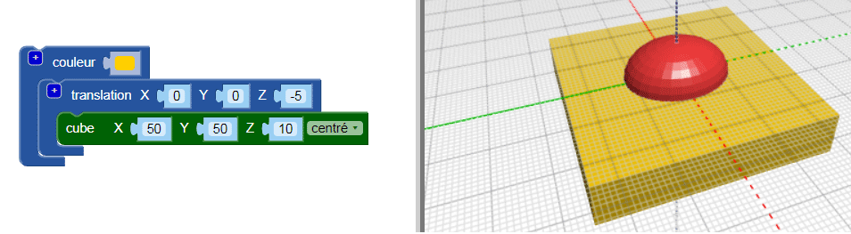
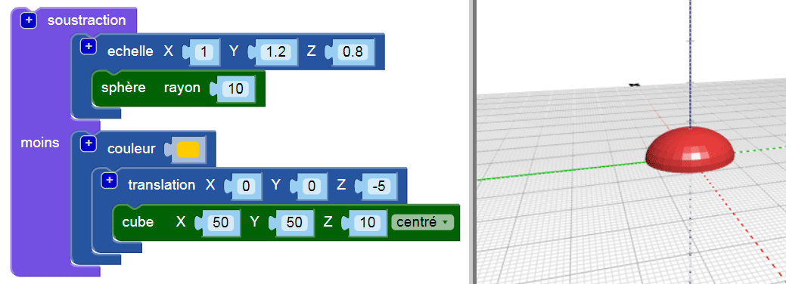

## Aplatir la base du corps

Aplatis maintenant la base du corps pour rendre ton insecte plus réaliste. Un modèle à base plate est également plus facile à imprimer en 3D!

Pour faire cela, tu peux simplement retirer un cuboïde de ton modèle à l'aide du bloc `soustraction`{:class="blockscadsetops"}.

--- task ---

Pour commencer, crée un cuboïde pour couvrir la moitié inférieure de l'insecte (la partie qui se trouve en dessous de 0 sur l'axe Z).

Le cuboïde doit être `centré` et de 10 mm de hauteur (le long de l'axe Z).

Ajoute un bloc `translation` pour déplacer le cuboïde de -5 mm le long de l'axe Z (vers le bas).

Pour qu'il soit facile de distinguer le cuboïde du corps de ton insecte, ajoute un bloc `couleur` pour que le cuboïde ait une couleur différente.

Le cuboïde est plus gros que le corps de l'insecte. Cela signifie que tu peux ajouter à l'insecte sans avoir à agrandir le cuboïde plus tard.

--- /task ---

--- task ---

Utilise un bloc `soustraction`{:class="blockscadsetops"} pour retirer le cuboïde du corps.

Maintenant, le corps de ton insecte a une base plate!

Fais tourner ton modèle dans la visionneuse pour le voir sous différents angles.

--- /task ---

  
