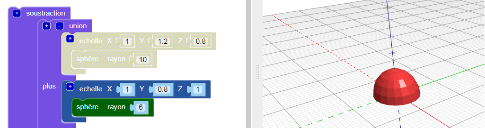
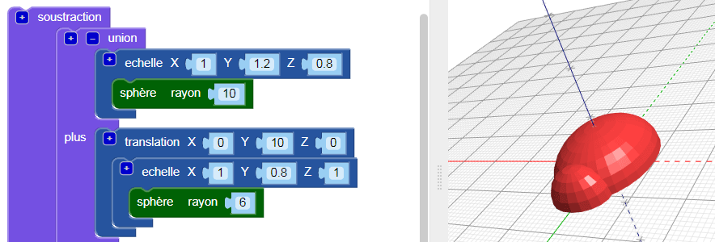
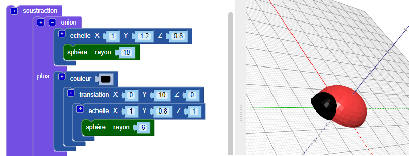
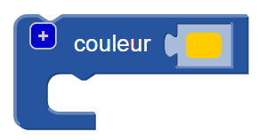
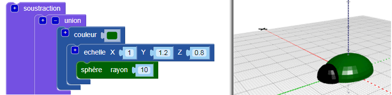

## Ajoute une tête à ton insecte

Crée maintenant une tête pour l'insecte.

--- task ---

Ajoute une petite `sphère` comme tête d'insecte. Pour le moment, tu ne peux pas voir cette nouvelle sphère, car elle est cachée à l'intérieur du corps.

Ajoute également un bloc `échelle` à la nouvelle `sphère` pour former la tête.

Ajoute ensuite un bloc `union`{:class="blockscadsetops"} pour combiner la tête et le corps.

--- /task --- --- task ---

Si tu souhaites voir la nouvelle sphère ``, désactive temporairement le corps en cliquant avec le bouton droit sur son bloc `échelle`{:class="blockscadtransforms"} et en choisissant **Désactivez le bloc**. Ensuite, ce bloc et ceux à l'intérieur sont grisés et le corps n'apparaît pas lorsque tu cliques sur **Rendu**.

Clique de nouveau avec le bouton droit sur le bloc et choisis **Activer le bloc** pour activer le corps.

--- /task --- --- task ---

`Fais une translation` de la tête le long de l'axe Y afin qu'elle dépasse du corps.

  

--- /task --- --- task ---

Si tu veux voir clairement les différentes formes, change la couleur de la tête.

You can also experiment with different colour combinations for decorating your printed bug with permanent markers.

--- /task --- --- task ---

Can you change the colour of the body of your bug model? You could change it to the colour of the filament you want to print with, or to the colour of the permanent marker you want to colour it with.

--- hints --- --- hint ---

This is the block you need.

--- /hint ---

--- hint ---

Here's an example with a green body:

--- /hint --- --- /hints --- --- /task ---

  
