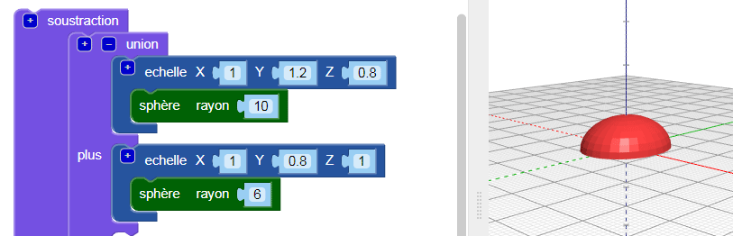

## Add a head to your bug

Now create a head for the bug.

--- task --- Add a smaller `sphere` as the bug's head. Right now you can't see this new sphere, because it's hidden inside the body.

Also add a `scale` block to the new `sphere` to shape the head.

Then add a `union`{:class="blockscadsetops"} block to combine the head and body.

--- /task --- --- task --- If you want to see the new `sphere`, then temporarily disable the body by right-clicking on its `scale`{:class="blockscadtransforms"} block and choosing **Disable block**. Then this block and the ones inside it are greyed out, and the body does not appear when you click **Render**.

Right-click on the block again and choose **Enable block** to enable the body.

--- /task --- --- task --- `Translate` the head along the Y axis so that it sticks out of the body.

  

--- /task --- --- task --- If you want to clearly see the different shapes, change the colour of the head.

You can also experiment with different colour combinations for decorating your printed bug with permanent markers.

--- /task --- --- task ---

Can you change the colour of the body of your bug model? You could change it to the colour of the filament you want to print with, or to the colour of the permanent marker you want to colour it with.

--- hints --- --- hint --- This is the block you need.

--- /hint ---

--- hint ---

Here's an example with a green body:

--- /hint --- --- /hints --- --- /task ---

  
