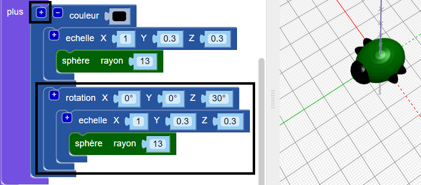
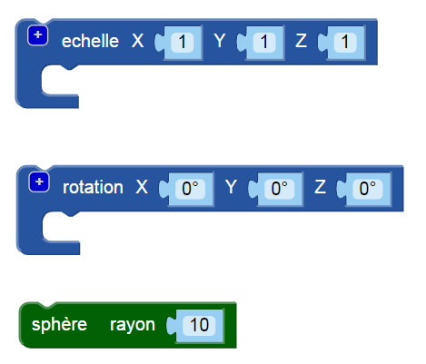

## Créer des pattes

Maintenant, l'insecte a besoin de six pattes!

--- task ---

Mets d'abord une paire de pattes au milieu du corps de l'insecte.

Clique sur le `+` en haut du bloc `union` pour ajouter une autre section. Ajoute une `sphère` étirée pour créer une paire de pattes.

--- /task ---

--- task ---

Si tu le souhaites, tu peux désactiver le corps de l'insecte pour voir comment les pattes sont faites.

Ensuite, réactive le corps pour continuer à travailler sur ton insecte.

--- /task ---

--- task ---

Ajoute maintenant une autre paire de pattes.

Ajoute une autre `sphère` `à l'échelle` avec les mêmes paramètres. Ensuite, `faire pivoter` de `30` degrés le long de l'axe Z de sorte que les pattes dépassent en biais.

Ton insecte a maintenant deux pattes du milieu et une patte avant et une patte arrière chacune!

--- /task ---

--- task ---

Peux-tu ajouter une troisième paire de pattes pour que l'insecte ait trois ensembles complets de paires de pattes?

Ton insecte doit ressembler à ceci:

--- hints ---
 --- hint ---

Tu dois ajouter une troisième `sphère` `à l'échelle`.

`Faire tourner`{:class="blockscadtransforms"} dans la sens opposé à la deuxième `sphère`. Il y a 360 degrés dans un cercle.

Voici les blocs dont tu auras besoin:

--- /hint ---

--- hint ---

Voici le code que tu as besoin:

--- /hint ---

--- /hints --- --- /task ---