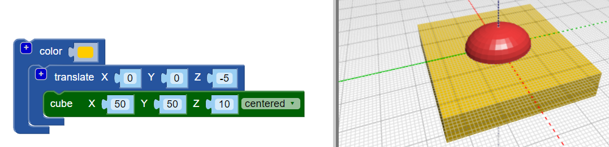

## משטחים את בסיס הגוף

כעת משטחים את בסיס הגוף כדי להפוך את הבאג שלך ליותר מציאותי. דגם עם בסיס שטוח קל גם יותר להדפסת תלת מימד!

כדי לעשות זאת, אתה יכול פשוט להסיר קוביות מהדגם שלך באמצעות `הבדל`{: class = "blockscadsetops"} לחסום.

--- task ---

כדי להתחיל, צור קובואידית לכיסוי המחצית התחתונה של החיידק (החלק שיושב מתחת ל 0 בציר Z).

הקובויד צריך להיות `במרכזו` ו- 10 מ"מ (לאורך ציר ה- Z).

הוסף חסימה `לתרגם` כדי להזיז את הקובויד -5 מ"מ לאורך ציר Z (למטה).

כדי להקל על הפרדת הקובויד וגוף החיידק שלך, הוסף בלוק `בצבע` כדי להפוך את הקובויד לצבע אחר.

הקובויד גדול מגופו של החיידק. משמעות הדבר היא שאתה יכול להוסיף לבאג בלי שתצטרך להגדיל את הקובויד בהמשך.

--- /task ---

--- task ---

השתמש בחסימה `בהפרש`{: class = "blockscadsetops"} כדי להסיר את הקובויד מהגוף.

עכשיו לגוף הבאג שלך יש בסיס שטוח!

גרור את הדגם שלך בצופה כדי לראות אותו מזוויות שונות.

--- /task ---

  
