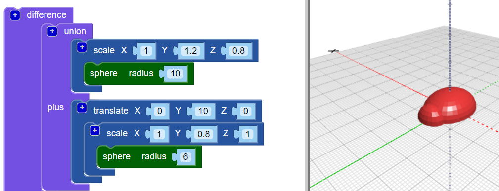

## הוסף ראש לבאג שלך

כעת צור ראש לבאג.

--- task ---

הוספה קטן `כדור` כראש של באג. כרגע אתה לא יכול לראות את התחום החדש הזה, מכיוון שהוא מוסתר בתוך הגוף.

גם להוסיף `בקנה מידה` לחסום את חדשות `בתחום` כדי לעצב את הראש.

לאחר מכן הוסף חסימת `איחוד`{: class = "blockscadsetops"} כדי לשלב את הראש והגוף.

--- /task --- --- task ---

אם אתה רוצה לראות את כדור ה- `החדש`, השבת את הגוף באופן זמני על ידי לחיצה ימנית על סולם `שלו`: {: class = "blockscadtransforms"} חסום ובחר **השבת בלוק**. ואז החסימה הזו ואלו שבתוכה מאפירנים, והגוף לא מופיע כשאתה לוחץ על **Render**.

לחץ באמצעות לחצן העכבר הימני על החסימה ובחר **הפעל את החסימה** כדי לאפשר את הגוף.

--- /task --- --- task ---

`תרגם` את הראש לאורך ציר ה- Y כך שהוא יבקע מהגוף.

  

--- /task --- --- task ---

אם אתה רוצה לראות בבירור את הצורות השונות, שנה את צבע הראש.

אתה יכול גם להתנסות בשילובי צבעים שונים לקישוט הבאג המודפס שלך בסמנים קבועים.

--- /task --- --- task ---

האם אתה יכול לשנות את צבע גוף דגם הבאג שלך? אתה יכול לשנות אותו לצבע הנימה שאיתו תרצה להדפיס, או לצבע הטוש הקבוע שאיתו תרצה לצבוע אותו.

--- hints --- --- hint ---

זה החסימה שאתה צריך.

--- /hint ---

--- hint ---

להלן דוגמא עם גוף ירוק:

--- /hint --- --- /hints --- --- /task ---

  
