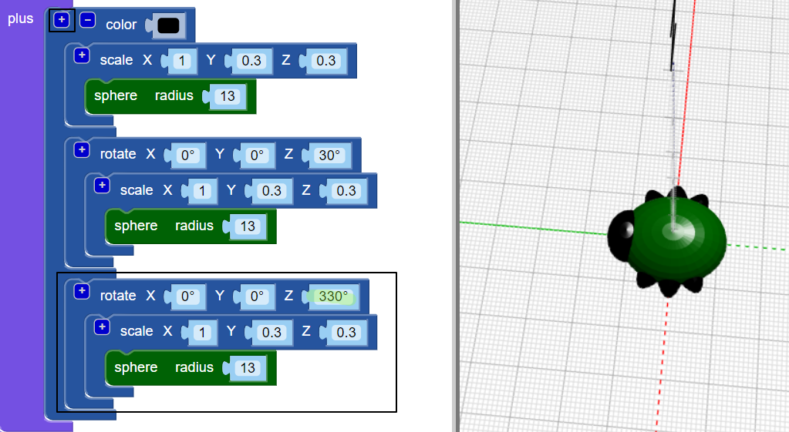

## צור רגליים

עכשיו החיידק זקוק לשש רגליים!

--- task ---

תחילה הכניסו זוג רגליים לאמצע גוף החיידק.

לחץ על `+` בראש של `באיגוד` בלוק להוסיף סעיף נוסף. הוספת נמתח `כדור` ליצור זוג רגליים.

--- /task ---

--- task ---

אם תרצו, תוכלו להשבית את גוף החיידק בכדי לראות כיצד נוצרות הרגליים.

ואז אפשר לגוף שוב להמשיך לעבוד על הבאג שלך.

--- /task ---

--- task ---

כעת הוסיפו זוג רגליים נוסף.

הוסף עוד `בקנה מידה` `כדור` עם אותן הגדרות. אז `סובב` זה על ידי `30` degress לאורך Z ציר כך שהרגליים בולטות החוצה בזווית.

כעת יש באג שלך שתי רגליים אמצעיות ורגל קדמית אחת ורגל אחורית כל אחת!

--- /task ---

--- task ---

האם אתה יכול להוסיף זוג רגליים שלישי כך שלבאג יהיו שלוש קבוצות שלמות של זוגות רגליים?

הבאג שלך צריך להיראות כך:

--- hints --- --- hint ---

אתה צריך להוסיף `שלישית בקנה מידה` `כדור`.

`סובב`{: class = "blockscadtransforms"} זה בכיוון ההפוך לתחום `השני`. יש 360 מעלות במעגל.

להלן הבלוקים שאתה צריך:

--- /hint ---

--- hint ---

להלן הקוד הדרוש:

--- /hint ---

--- /hints --- --- /task ---