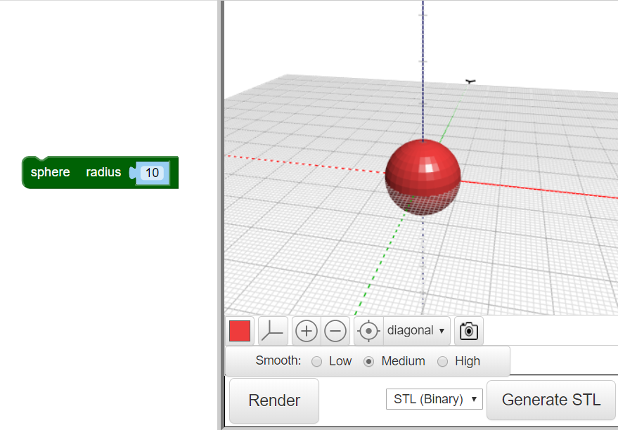

## अपने बग को शरीर दें

--- task ---

एक वेब ब्राउज़र (web browser) में BlocksCAD editor खोलें [blockscad3d.com/editor/](https://www.blockscad3d.com/editor/){:target="_blank"}

--- /task ---

अब अपने बग की शरीर बनाएं।

--- task ---

शुरू कीजिये एक `sphere` से जिसका त्रिज्या (radius) `10` (यहां इकाई मिलीमीटर की है):

परिणाम देखने के लिए **Render** बटन पर क्लिक करें।

टिप: अपने मॉडल का रंग बदलने के लिए रंगीन चौकोर टुकड़े पर क्लिक करें।

--- /task --- --- task ---

अब बग का लम्बा शरीर बनाने के लिए, इस गोला (sphere) को Y axis के साथ फैलाएं।

`scale`{:class="blockscadtransforms"} ब्लॉक आपको X, Y और Z axes के साथ वस्तुओं को खींचने या पिचकाने की अनुमति देता है। Y axis के साथ गोले को फैलाने के लिए Y को `1.2` मूल्य पर सेट करें।

**Render** पे फिर से क्लिक करें और जांचें कि गोला फैलकर एक दीर्घवृत्ताभ (ellipsoid) बन गया है। अपने मॉडल को विभिन्न कोणों से देखें ताकि आप देख सकें कि यह कैसे बदला है।

--- /task ---

टिप: हर बार जब आप कोड में बदलाव करते हैं, तो परिणाम देखने के लिए आपको **Render** पर क्लिक करना होगा।

--- task ---

अब थोड़ा और चपटा बग बनाने के लिए z-axis के समानांतर दीर्घवृत्ताभ (ellipsoid) को पिचकाएं |

Axis का मूल्य `1` से कम सेट करने से उस अक्ष (axis) के समानांतर वस्तु को छोटा बनाता है। इसलिए Z का मूल्य `scale`{:class="blockscadtransforms"} ब्लॉक में `0.8` में बदल दें।

--- /task ---

