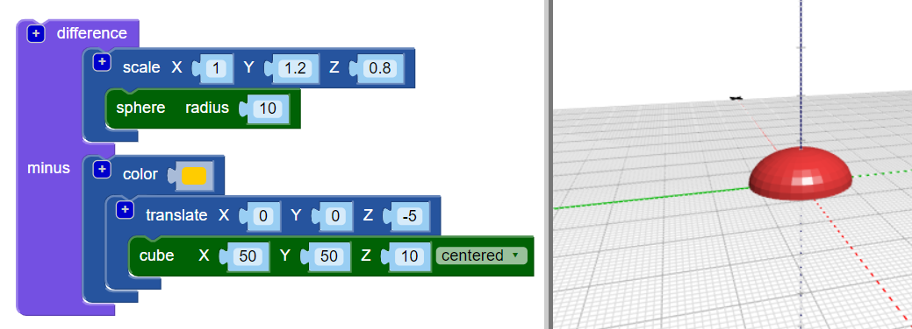

## शरीर के आधार (base) को चपटा करें

अब अपने बग को थोड़ा और वास्तविक बनाने के लिए शरीर के आधार (base) को चपटा करें। एक चपटा आधार (base) वाला मॉडल (model) 3D प्रिंट करने में भी आसान है!

ऐसा करने के लिए आप केवल `difference`{:class="blockscadsetops"} ब्लॉक का उपयोग करके अपने मॉडल से एक घनाभ (cuboid) निकाल सकते हैं।

--- task ---

शुरू करने के लिए, बग के निचले आधे हिस्से को कवर करने के लिए एक घनाभ (cuboid) बनाएं (वह भाग जो Z axis पर 0 से नीचे बैठता है)।

घनाभ (cuboid) `centered` और 10mm लंबा (Z axis के समानांतर) होना चाहिए।

यह `translate` ब्लॉक जोड़ें घनाभ को -5mm Z axis (नीचे) के समानांतर हिलाने के लिए ।

घनाभ और अपने बग के शरीर को को आसानी से पहचानने के लिए, घनाभ को एक अलग रंग दें और `color` ब्लॉक जोड़ें।

अभी घनाभ बग के शरीर से बड़ा है। इसका मतलब है कि आप बाद में घनाकार को बड़ा करने की आवश्यकता के बिना बग में जोड़ सकते हैं।

--- /task ---

--- task ---

शरीर से घनाभ (cuboid) हटाने के लिए `difference`{:class="blockscadsetops"} ब्लॉक का उपयोग करें।

अब आपके बग के शरीर का सपाट आधार (flat base) है!

विभिन्न कोणों से देखने के लिए अपने मॉडल को व्यूअर (viewer) में चारों ओर खींचें।

--- /task ---

  
