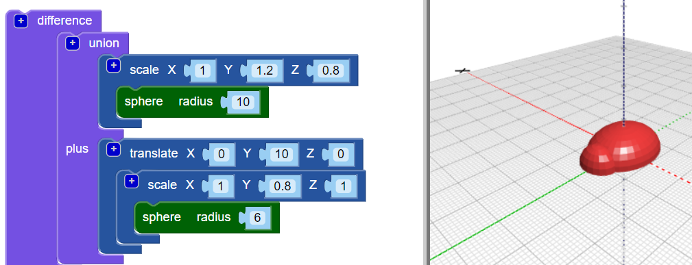
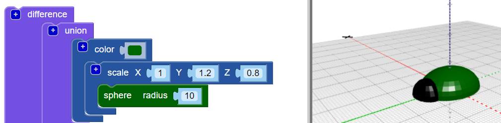

## Dodajte glavu svom bugu

Sada stvorite glavu za bug.

--- task ---

Dodajte manju `sferu` kao glavu buba. Trenutno ne možete vidjeti ovu novu sferu jer je skrivena u tijelu.

Također dodajte `razmjera` blok za novi `kugle` oblikovati glavu.

Zatim dodajte blok `union`{: class = "blockscadsetops"} da biste kombinirali glavu i tijelo.

--- /task --- --- task ---

Ako želite vidjeti novu `sferu`, tada privremeno onemogućite tijelo klikom desne tipke miša na njegov `ljestvici`{: class = "blockscadtransforms"} blok i odabirom **Onemogući blok**. Tada se ovaj blok i oni unutar njega iscrtavaju, a tijelo se ne pojavljuje kada kliknete na **Render**.

Desnom tipkom miša ponovo kliknite na blok i odaberite **Omogući blok** da biste omogućili tijelo.

--- /task --- --- task ---

`Prevedite` glavu duž osi Y tako da izlazi iz tijela.

  

--- /task --- --- task ---

Ako želite jasno vidjeti različite oblike, promijenite boju glave.

Možete i eksperimentirati s različitim kombinacijama boja za ukrašavanje ispisane bube trajnim markerima.

--- /task --- --- task ---

Možete li promijeniti boju karoserije svog modela bugova? Možete je promijeniti u boju niti s kojom želite ispisati ili u boju trajnog markera s kojim želite obojiti.

--- hints --- --- hint ---

Ovo je blok koji vam treba.

--- /hint ---

--- hint ---

Evo primjera sa zelenim tijelom:

--- /hint --- --- /hints --- --- /task ---

  
