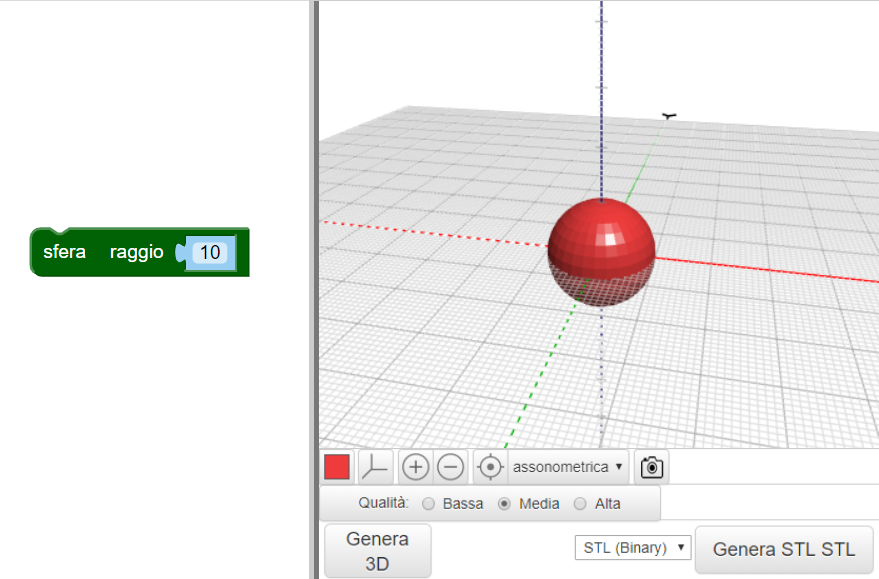
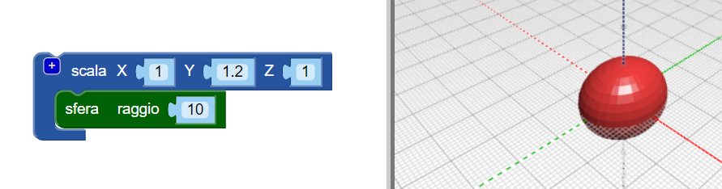
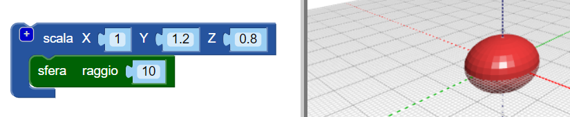

## Dai un corpo al tuo insetto

--- task ---

Apri l'editor BlocksCAD in un browser Web [blockscad3d.com/editor/](https://www.blockscad3d.com/editor/){:target="_ blank"}

--- /task ---

Ora crea il corpo del tuo insetto.

--- task ---

Inizia con una `sfera` con un raggio di `10` (l'unità di misura è il millimetro):

Fai clic sul pulsante **Genera 3D** per vedere il risultato.

Suggerimento: puoi cambiare il colore del modello renderizzato facendo clic sul quadrato colorato.

--- /task --- --- task ---

Ora allunga la sfera lungo il suo asse Y per dare all'insetto un corpo allungato.

Il blocco `scala`{:class="blockscadtransforms"} consente di allungare o schiacciare gli oggetti lungo gli assi X, Y e Z. Impostare il valore Y su `1.2` per allungare la sfera lungo l'asse Y.

Clicca **Genera 3D** ancora una volta e verifica che la sfera sia stata dilatatata in un ellissoide. Guarda il tuo modello da diverse angolazioni in modo da poter vedere come è cambiato.

--- /task ---

Suggerimento: ogni volta che apporti una modifica al codice, devi fare clic su **Genera 3D** per visualizzare il risultato.

--- task ---

Ora schiaccia un po' l'ellissoide lungo l'asse z per creare un insetto più piatto.

L'impostazione di un valore dell'asse inferiore a `1` rende l'oggetto più piccolo lungo quell'asse. Quindi cambia il valore Z nel blocco `scala`{:class="blockscadtransforms"} a `0.8`.

--- /task ---

