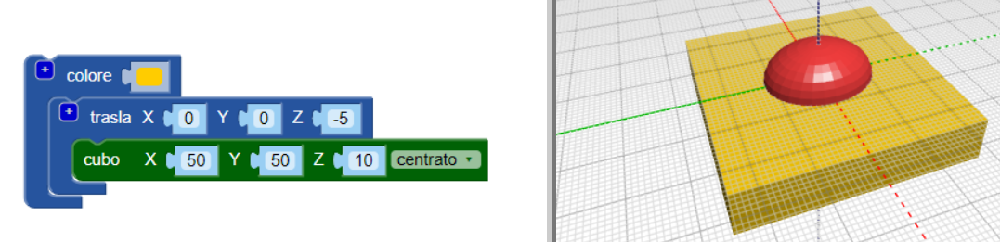
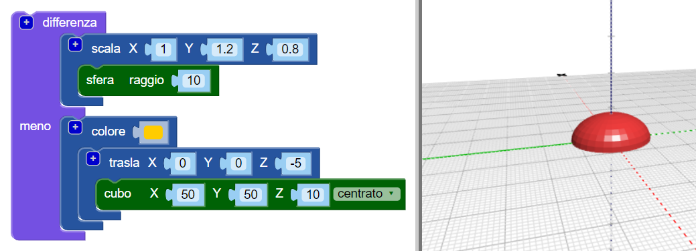

## Appiattisci la base del corpo

Ora appiattisci la base del corpo per rendere il tuo insetto più realistico. Un modello con una base piatta è anche più facile da stampare in 3D!

Per fare ciò, puoi semplicemente rimuovere un cuboide dal tuo modello usando il blocco `differenza`{:class="blockscadsetops"}.

--- task ---

Per iniziare, crea un cuboide per coprire la metà inferiore dell'insetto (la parte che si trova sotto lo zero sull'asse Z).

Il cuboide dovrebbe essere `centrato` e alto 10 mm (lungo l'asse Z).

Aggiungi un blocco `trasla` per spostare il parallelepipedo -5 mm lungo l'asse Z (verso il basso).

Per rendere più semplice distinguere il cuboide dal corpo del tuo insetto, aggiungi un blocco `colore` per dare al cuboide un colore diverso.

Il cuboide è più grande del corpo dell'insetto. Ciò significa che è possibile aggiungere elementi all'insetto senza dover ingrandire il cuboide in seguito.

--- /task ---

--- task ---

Utilizza un blocco `differenza`{:class="blockscadsetops"} per rimuovere il cuboide dal corpo.

Ora il corpo del tuo insetto ha una base piatta!

Trascina il tuo modello nel visualizzatore per vederlo da diverse angolazioni.

--- /task ---

  
