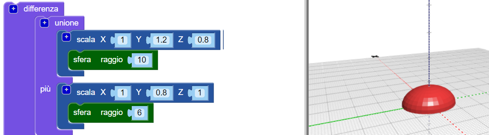
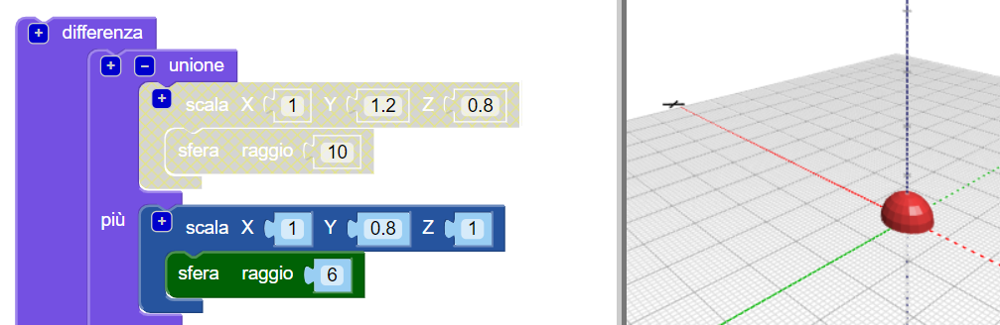
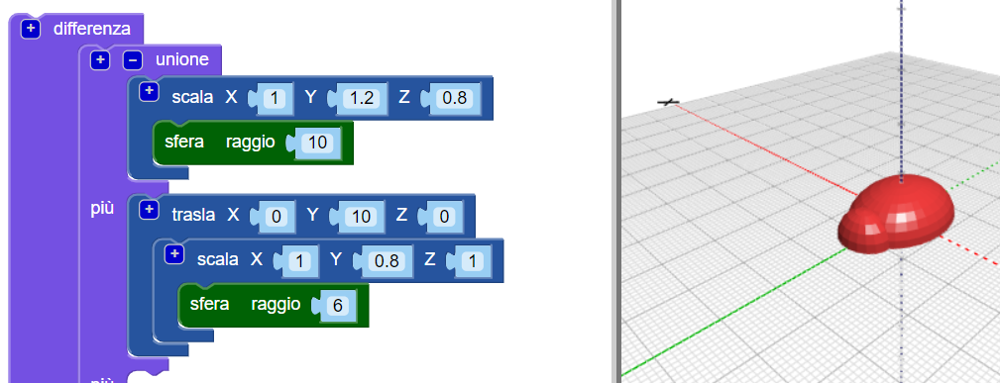
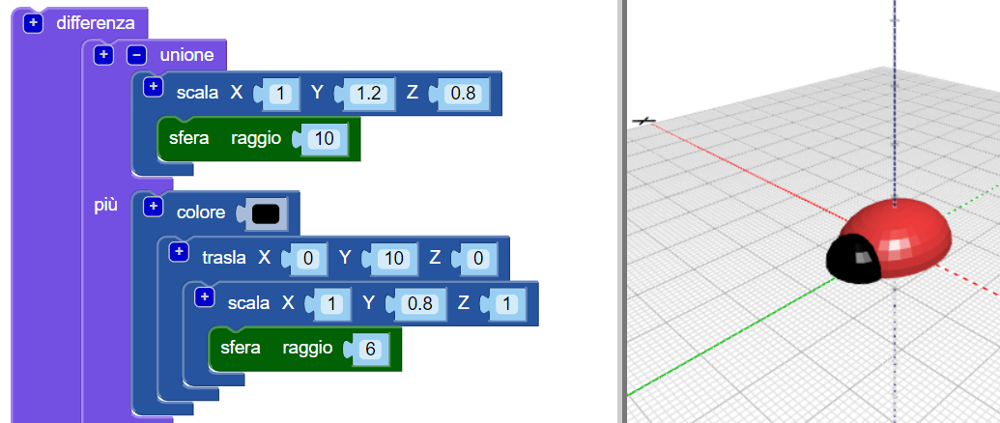
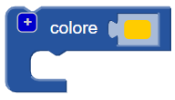
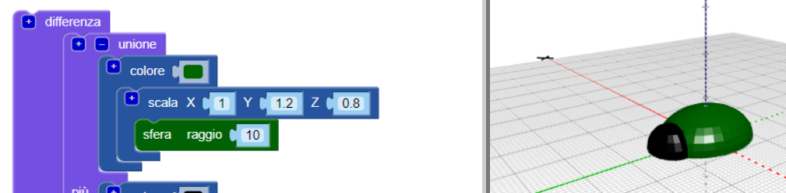

## Aggiungi una testa al tuo insetto

Ora crea una testa per l'insetto.

--- task ---

Come testa dell'insetto, aggiungi una `sfera` più piccola. In questo momento non puoi vedere questa nuova sfera, perché è nascosta all'interno del corpo.

Aggiungi anche un blocco `scala` alla nuova `sfera` per modellare la testa.

Quindi aggiungi un blocco `unione`{:class="blockscadsetops"} per combinare testa e corpo.

--- /task --- --- task ---

Se vuoi vedere la nuova `sfera`, disabilita temporaneamente il corpo facendo clic con il tasto destro del mouse sul blocco `scala`{:class="blockscadtransforms"} e scegliendo **Disattiva blocco**. Così questo blocco e quelli al suo interno vengono disattivati e il corpo non viene visualizzato quando si fa clic su **Genera 3D**.

Fai di nuovo clic con il pulsante destro del mouse sul blocco e scegli **Attiva blocco** per abilitare il corpo.

--- /task --- --- task ---

`Trasla` la testa lungo l'asse Y in modo che sporga dal corpo.

  

--- /task --- --- task ---

Se vuoi vedere chiaramente le diverse forme, cambia il colore della testa.

Puoi anche sperimentare diverse combinazioni di colori per decorare, successivamente, con pennarelli indelebili il tuo insetto stampato.

--- /task --- --- task ---

Riesci a cambiare il colore del corpo del tuo modello di insetto? È possibile cambiarlo con il colore del filamento con cui si desidera stamparlo o con il colore del pennarello permanente con cui si vuol colorarlo.

--- hints --- --- hint ---

Questo è il blocco che ti serve.

--- /hint ---

--- hint ---

Ecco un esempio con un corpo verde:

--- /hint --- --- /hints --- --- /task ---

  
