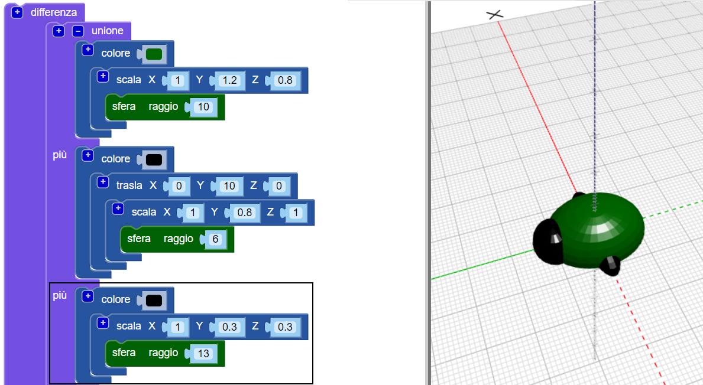
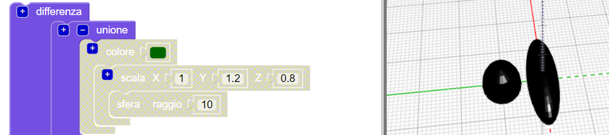
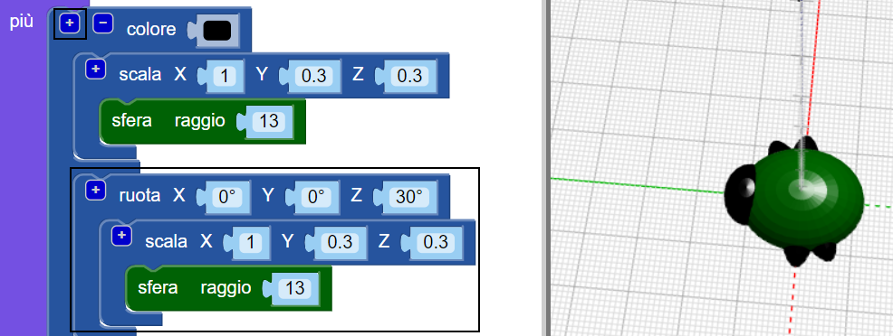
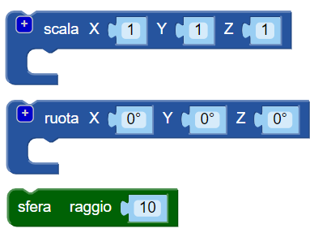
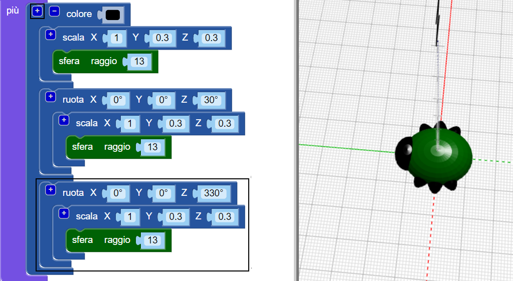

## Crea le zampe

Ora l'insetto ha bisogno di sei zampe!

--- task ---

Per prima cosa metti un paio di zampe al centro del corpo dell'insetto.

Click the `+` at the top of the `union` block to add another section. Aggiungi una `sfera` allungata per creare un paio di zampe.

--- /task ---

--- task ---

Se lo desideri, puoi disabilitare il corpo del bug per vedere come sono fatte le zampe.

Quindi abilita nuovamente il corpo per continuare a lavorare sul tuo insetto.

--- /task ---

--- task ---

Ora aggiungi un altro paio di zampe.

Add another `scaled` `sphere` with the same settings. Quindi `ruota` di `30` gradi lungo l'asse Z in modo che le zampe sporgano ad angolo.

Ora il tuo insetto ha due zampe centrali e una anteriore e una posteriore ciascuna!

--- /task ---

--- task ---

Riesci ad aggiungere un terzo paio di zampe in modo che l'insetto abbia tre gruppi completi di coppie di zampe?

Il tuo insetto deve apparire così:

--- hints --- --- hint ---

Devi aggiungere un terzo `scala` `sfera`.

`Ruota`{:class="blockscadtransforms"} nella direzione opposta alla seconda `sfera`. Ci sono 360 gradi in una circonferenza.

Ecco i blocchi di codice che ti serviranno:

--- /hint ---

--- hint ---

Ecco il codice che ti serve:

--- /hint ---

--- /hints --- --- /task ---