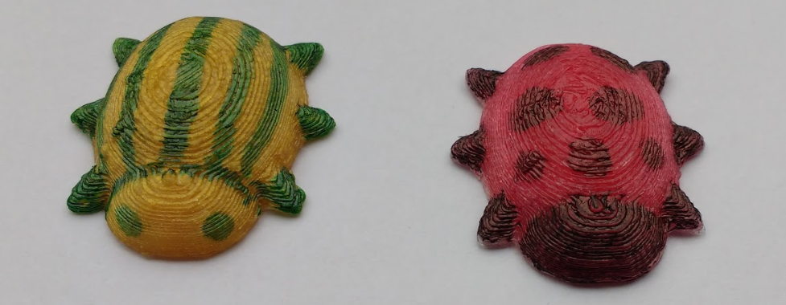

## Stampa 3D e decora il tuo oggetto

Se hai accesso a una stampante 3D, ora puoi stampare il tuo insetto e poi decorarlo.

--- task ---

Genera il modello 3D e quindi fai clic su **Genera STL**. Ricorda dove salvi il file STL.

--- /task --- --- task ---

Stampa 3D il tuo il insetto.

Puoi stampare usando il colore principale del tuo insetto, oppure puoi usare filamenti neutri o bianchi.

--- /task ---

--- task ---

Finish your bug using permanent marker pens!

You could colour the head and legs in black, or add spots or stripes in another colour.

Here are some examples:

--- /task ---

 

  
