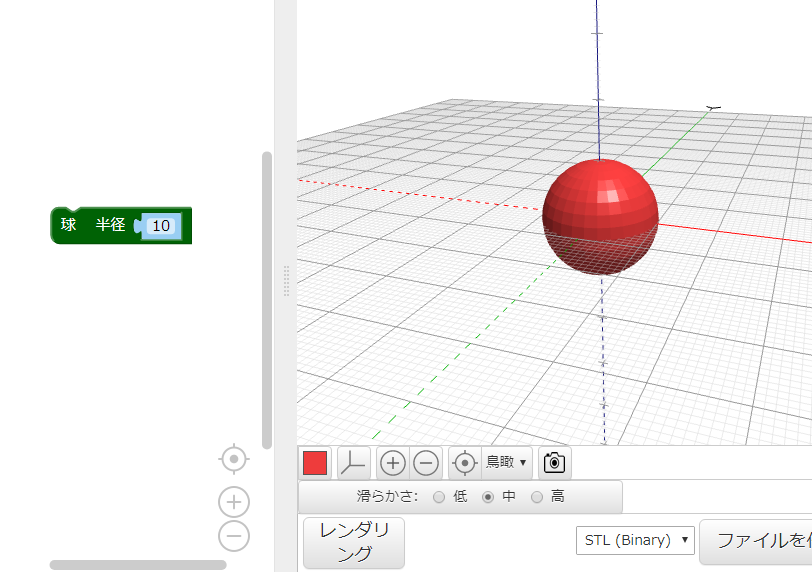
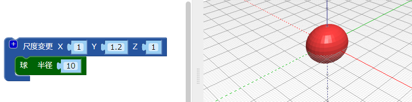
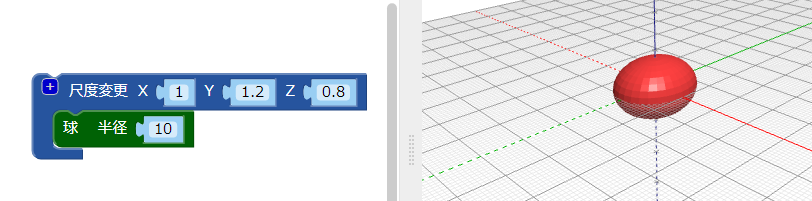

## 虫の体を作る

--- task ---

ウェブブラウザで BlocksCAD エディターを開きます。 [blockscad3d.com/editor/](https://www.blockscad3d.com/editor/){:target="_blank"}

--- /task ---

虫の体の部分を作っていきましょう。

--- task ---

半径 (はんけい) `10` （ここでの単位はミリメートルです）の `球`から始めます。

**レンダリング** ボタンをクリックして、どのようなものができたか見てみましょう。

(ヒント) 色つきの四角をクリックすると、レンダリングされたモデルの色をかえることができます。

--- /task --- --- task ---

Y軸 (じく) にそって球を引きのばし、虫の体を細長くします。

`尺度変更`{:class="blockscadtransforms"} (しゃくどへんこう) ブロックを使用すると、X、Y、Z軸にそって物体を引きのばしたりおしつぶしたりできます。 Y の値 (あたい) を `1.2` にすると、球体が Y軸にそって引きのばされます。

もう一度**レンダリング**をクリックし、球体が引きのばされてだ円体になることをたしかめます。 モデルをさまざまな角度から見て、どのようにかわったかをたしかめます。

--- /task ---

(ヒント) コードをかえる度に、結果を見るには **レンダリング** をクリックする必要があります。

--- task ---

次に、だ円体を Z軸にそって少しおしつぶし、少し平らな虫にします。

軸の値を `1` より下にすると、オブジェクトはその軸にそって小さくなります。 `尺度変更`{:class="blockscadtransforms"}ブロックの Z の値を `0.8`にします。

--- /task ---

