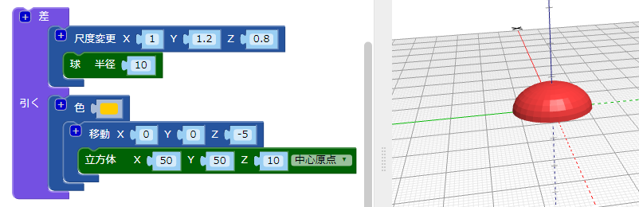

## 体の底面を平らにする

体の底面を平らにして、虫をより本物らしくします。 底面がフラットなモデルは3Dプリントもしやすいです！

これを行うには、 `差`{:class="blockscadsetops"}ブロックを使用して、モデルから直方体と重なる部分を削除するだけです。

--- task ---

まず、虫の体の下半分（Z軸で0の下にある部分）を覆う直方体を作成します。

直方体は `座標軸の中心にあり`、（Z軸に沿って）10mmの高さとします。

`移動` ブロックを追加して、直方体をZ軸に沿って-5mm（下へ）移動します。

直方体と虫の体を簡単に区別できるように、 `色` ブロックを追加して、直方体を別の色にします。

直方体は虫の体よりも大きいです。 なので、虫に何かを追加しても直方体を後で大きくする必要はありません。

--- /task ---

--- task ---

`差`{:class="blockscadsetops"}ブロックを使用して、体と直方体が重なってる部分を削除します。

これで、虫の体の底面が平らになりました。

ビューア内でモデルをドラッグして、さまざまな角度から見ることができます。

--- /task ---

  
