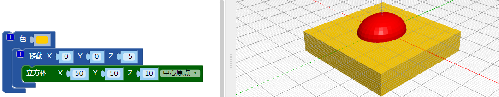

## 体の付け根を平らにする

本体の底面を平らにして、バグをより現実的にします。 底面がフラットなモデルも3Dプリントしやすい！

これを行うには、 `差`{：class = "blockscadsetops"}ブロックを使用して、モデルから直方体を削除するだけです。

--- task ---

まず、バグの下半分（Z軸で0の下にある部分）を覆う直方体を作成します。

立方体は `を中心にして` と10mmの高さでなければなりません（Z軸に沿って）。

`平行移動` ブロックを追加して、直方体をZ軸に沿って-5mm移動します（下）。

直方体とバグの体を簡単に区別できるようにするには、 `色` ブロックを追加して、直方体を別の色にします。

直方体は虫の体よりも大きい。 これは、直方体を後で大きくする必要なく、バグを追加できることを意味します。

--- /task ---

--- task ---

`差`{：class = "blockscadsetops"}ブロックを使用して、ボディから直方体を削除します。

これで、バグの本体の底面が平らになりました。

ビューア内でモデルをドラッグして、さまざまな角度から見ます。

--- /task ---

  
