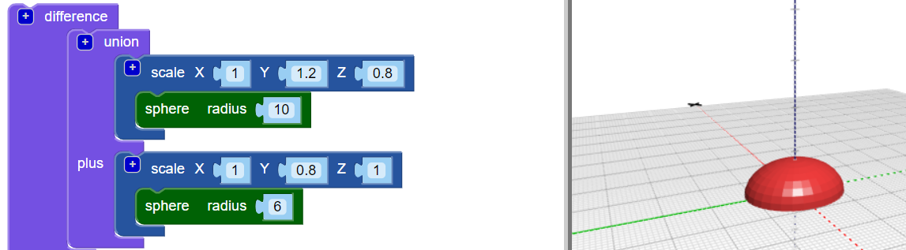
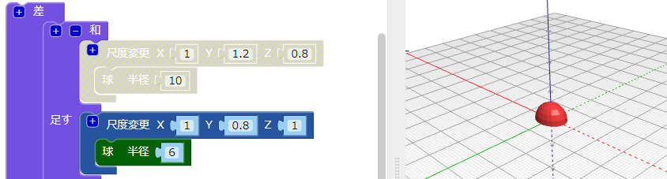
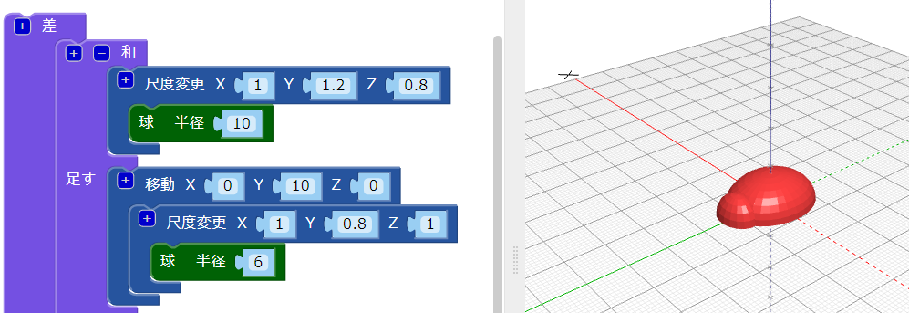
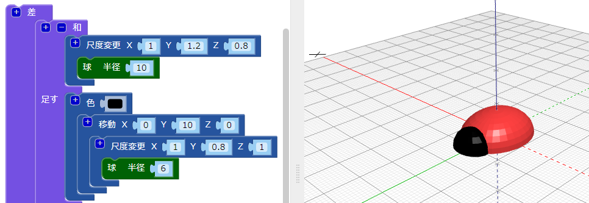
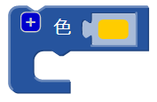
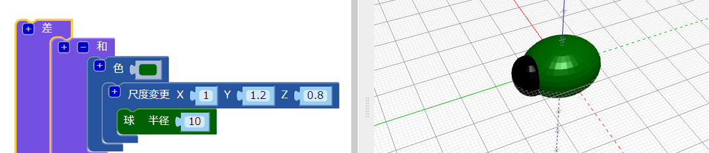

## 虫に頭をつける

虫の頭の部分を作りましょう。

--- task ---

小さめの `球` を虫の頭として追加します。 このとき、追加した球体は体の中に隠れているため、見えません。

体の時と同じように、追加した `球` に `尺度変更` ブロックを追加して、頭の形にします。

次に、 `和`{:class="blockscadsetops"}ブロックを追加して、頭と体を結合します。

--- /task --- --- task ---

追加した `球`を見たい場合は、 体の`尺度変更`{:class="blockscadtransforms"}ブロックを右クリックし、**ブロックを無効にします。**を選択して、一時的に無効にします。 そうすると、このブロックとその中のブロックはグレー表示になり、 **レンダリング**をクリックすると体は表示されなくなります。

もう一度ブロックを右クリックし、**ブロックを有効にします。** を選択して体の表示を有効にします。

--- /task --- --- task ---

頭部をY軸に沿って`移動` し、体から突き出るようにします。

  

--- /task --- --- task ---

それぞれの部分をはっきりと見たい場合は、頭の色を変更してください。

3Dプリントした虫をマジックペンでさまざまなに塗り分けることも試してみてください。

--- /task --- --- task ---

虫のモデルの体の部分の色を変更できますか？ 印刷するフィラメントの色を変えたり、マジックペンで色を付けたりすることで変更できます。

--- hints --- --- hint ---

必要なブロックはこれです。

--- /hint ---

--- hint ---

この例では体の色は緑です。

--- /hint --- --- /hints --- --- /task ---

  
