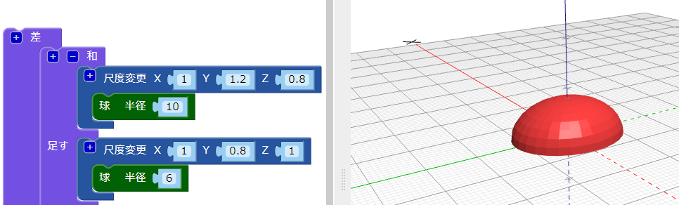

## 虫に頭をつける

虫の頭の部分を作りましょう。

--- task ---

小さめの `球` を虫の頭として追加します。 このとき、追加した球体は体の中にかくれているため、見えません。

体の時と同じように、追加した `球` に `尺度変更` ブロックを追加して、頭の形にします。

次に、 `和`{:class="blockscadsetops"}ブロックを追加して、頭と体を合体します。

--- /task --- --- task ---

追加した`球`を見たい場合は、 体の`尺度変更`{:class="blockscadtransforms"}ブロックを右クリックし、**ブロックを無効 (むこう) にします。**を選択 (せんたく) して、一時的に無効にします。 そうするとこのブロックとその中のブロックはグレー表示 (ひょうじ) になり、 **レンダリング**をクリックしても体は表示されなくなります。

もう一度ブロックを右クリックし、**ブロックを有効 (ゆうこう) にします。** を選択して体の表示を有効にします。

--- /task --- --- task ---

頭部をY軸にそって`移動` し、体からつき出るようにします。

  

--- /task --- --- task ---

それぞれの部分をはっきりと見たい場合は、頭の色をかえましょう。

3D プリントした虫をマジックペンでさまざまな色でぬることもできます。

--- /task --- --- task ---

虫の体の部分の色をかえられますか？ 印刷したいフィラメントの色や、使いたいマジックペンの色にかえることができます。

--- hints ---
 --- hint ---

必要なブロックはこちらです。

--- /hint ---

--- hint ---

ここでは体の色は緑です。

--- /hint ------ /hints --- --- /task ---

  
