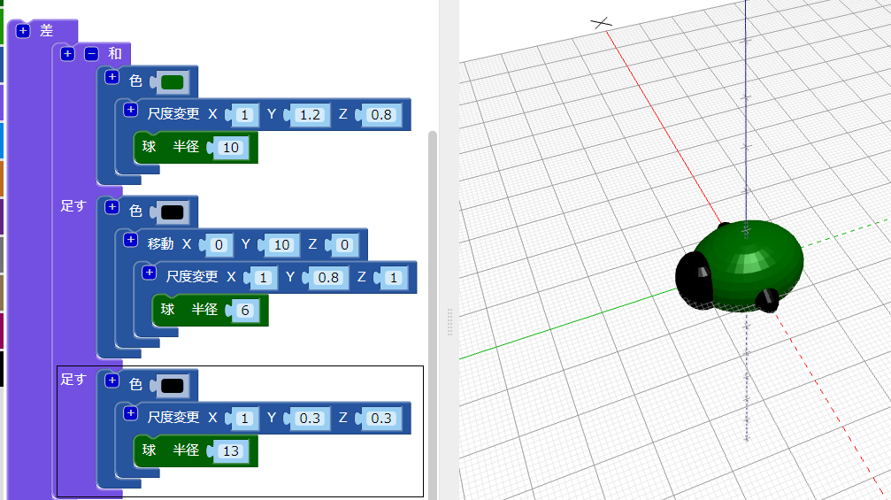
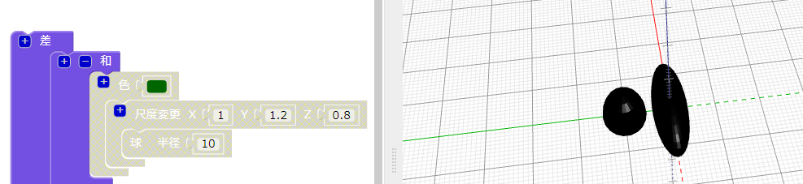
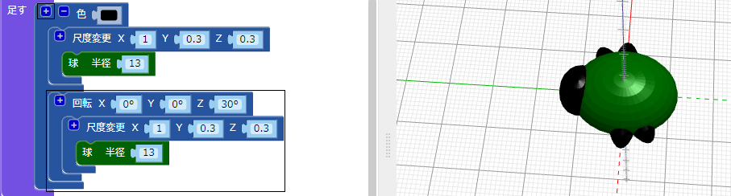
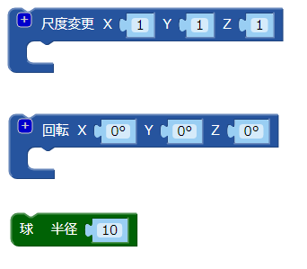
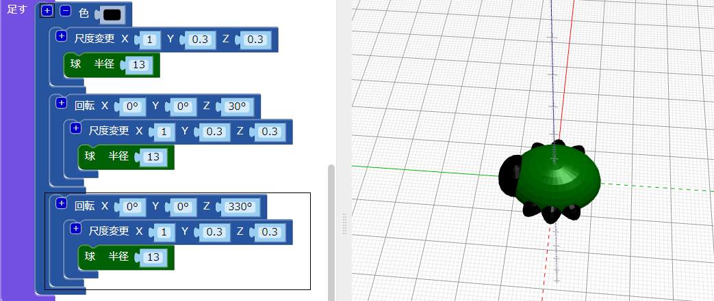

## 足を作る

次に足を6本の足付けましょう！

--- task ---

まず、虫の体の真ん中に足を一対置きます。

`和` ブロックの上部にある `+` をクリックして、もう一つセクションを追加します。 引き伸ばした `球` を追加して、一対の足を作ります。

--- /task ---

--- task ---

必要に応じて、虫の体の部分を無効にして、足がどのように作成されているかを確認します。

終わったら、体を再度有効にして、作成作業を続けます。

--- /task ---

--- task ---

次に、別の足の対を追加します。

同じ設定で、 `尺度変更`された `球` をもう一つ追加します。 次に、Z軸に沿って `30` 度 `回転` させます。これにより、足が斜めに突き出します。

これで、虫には2本の中足とそれぞれ1本ずつの前足と後足ができました。

--- /task ---

--- task ---

虫の足がに3対になるように、3番目の足の対を追加できますか？

虫はこのようなります。

--- hints --- --- hint ---

3番目の `尺度変更` した`球`を追加する必要があります。

それを2番目の `球体`と反対方向に`回転`{:class="blockscadtransforms"}させます 。 円は一周360度です。

次のブロックが必要です。

--- /hint ---

--- hint ---

必要なコードは次のとおりです。

--- /hint ---

--- /hints --- --- /task ---