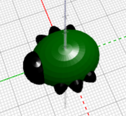

## 足を作る

次は虫に6本の足をつけましょう！

--- task ---

まず、虫の体の真ん中に足を一対おきます。

`和` ブロックの上部にある `+` をクリックして、もう一つセクションを追加します。 引きのばした `球` を追加して、一対の足を作ります。

--- /task ---

--- task ---

必要におうじて、虫の体の部分を無効にして、足がどのように作成されているかをたしかめることもできます。

終わったら、体を再度有効にして、作業をつづけます。

--- /task ---

--- task ---

次に、別の足の対を追加します。

同じように、 `尺度変更`された `球` をもう一つ追加します。 次に、Z軸にそって `30` 度 `回転` させます。こうすると、足がななめにつき出ます。

これで、虫には2本の中足と、前足と後足がそれぞれ1本ずつできました。

--- /task ---

--- task ---

虫の足が3対になるように、3番目の足の対を追加できますか？

虫はこのようになります。

--- hints --- --- hint ---

3番目の `尺度変更` した`球`を追加する必要があります。

2番目の `球体`と反対方向に`回転`{:class="blockscadtransforms"}させます 。 円は一周 (しゅう) 360度です。

必要なブロックは次のとおりです。

--- /hint ---

--- hint ---

必要なコードは次のとおりです。

--- /hint ---

--- /hints --- --- /task ---