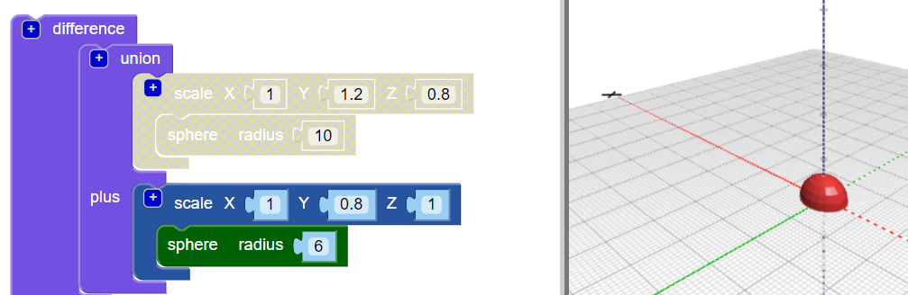

## Voeg een hoofd toe aan je kever

Maak nu een hoofd voor de kever.

--- task ---

Voeg een kleinere `sphere` toe als kop van de kever. Op dit moment kun je deze nieuwe bol niet zien, omdat hij verborgen is in het lichaam.

Voeg ook een `scale` blok toe aan de nieuwe `sphere` om de kop vorm te geven.

Voeg vervolgens een `union (samenvoeging)`{:class="blockscadsetops"}-blok toe om hoofd en lichaam te combineren.

--- /task --- --- task ---

Als je de nieuwe `sphere` wilt zien, schakel dan tijdelijk het lichaam uit door met de rechtermuisknop te klikken op het `scale`{:class="blockscadtransforms"}-blok en kies **Disable block**. Vervolgens worden dit blok en de blokken erin grijs weergegeven en wordt het lichaam niet weergegeven wanneer je op **Render** klikt.

Klik opnieuw met de rechtermuisknop op het blok en kies **Enable Block** om het lichaam weer te tonen.

--- /task --- --- task ---

`Translate` het hoofd langs de Y-as zodat het uit het lichaam steekt.

  

--- /task --- --- task ---

Als je de verschillende vormen duidelijk wilt zien, verander dan de kleur van het hoofd.

Je kunt ook experimenteren met verschillende kleurencombinaties voor het decoreren van je geprinte kever met permanente stiften.

--- /task --- --- task ---

Kun je de kleur van het lichaam van je kevermodel veranderen? Je kunt het wijzigen in de kleur van het filament waarmee je wilt printen of in de kleur van de permanente stift waarmee je het wilt kleuren.

--- hints ---
 --- hint ---

Dit is het blok dat je nodig hebt.

--- /hint ---

--- hint ---

Hier is een voorbeeld met een groen lichaam:

--- /hint --- --- /hints --- --- /task ---

  
