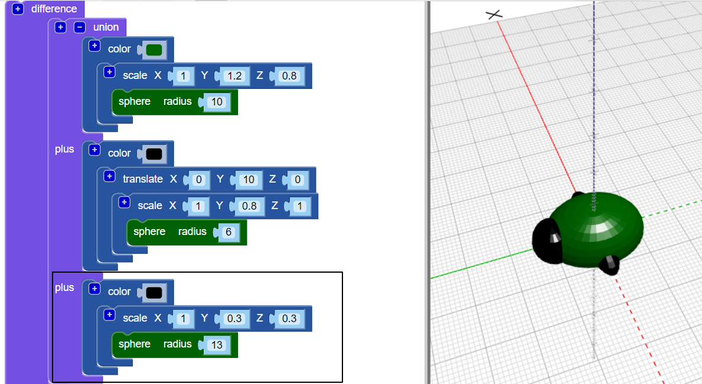
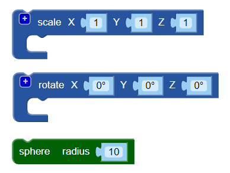

## Maak benen

Nu heeft de kever zes poten nodig!

--- task ---

Leg eerst een paar poten in het midden van het lijf van de kever.

Klik op de `+` bovenaan het blok `union` om nog een sectie toe te voegen. Voeg een uitgerekte `sphere` toe om een paar benen te maken.

--- /task ---

--- task ---

Als je wilt, kun je de body van de kever uitschakelen om te zien hoe de benen zijn gemaakt.

Schakel het lichaam vervolgens opnieuw in om aan je kever te blijven werken.

--- /task ---

--- task ---

Voeg nu nog een paar poten toe.

Voeg nog een `scale` `bol` met dezelfde instellingen toe. Draai vervolgens met `rotate` de benen `30` graden omlaag langs de Z-as zodat deze schuin uitsteken.

Nu heeft je insect twee middelste benen en een voor- en achterbeen!

--- /task ---

--- task ---

Kun je een derde paar poten toevoegen zodat de kever drie complete sets poten heeft?

Je kever moet er als volgt uitzien:

--- hints --- --- hint ---

Je moet een derde `scale` `sphere` toevoegen.

`Rotate`{:class="blockscadtransforms"} in de tegengestelde richting van de tweede `sphere`. Er zitten 360 graden in een cirkel.

Dit zijn de blokken die je nodig hebt:

--- /hint ---

--- hint ---

Hier is de code die je nodig hebt:

--- /hint ---

--- /hints --- --- /task ---