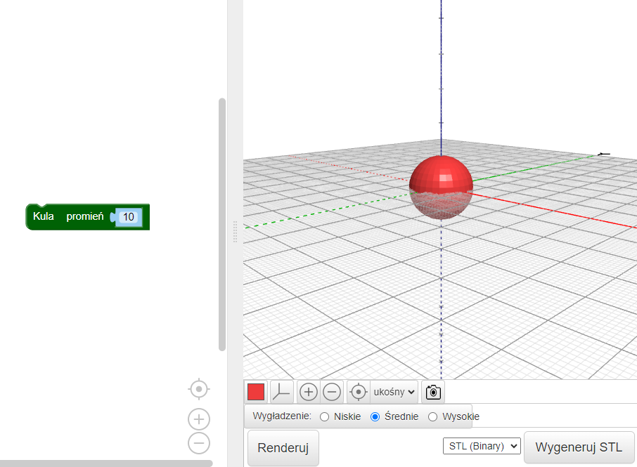
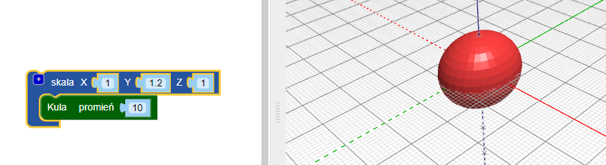
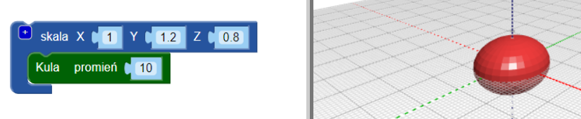

## Nadaj swojemu żuczkowi tułów

--- task ---

Otwórz edytor BlocksCAD w przeglądarce internetowej [blockscad3d.com/editor/](https://www.blockscad3d.com/editor/){:target="_ blank"}

--- /task ---

Teraz stwórz tułów swojego żuczka.

--- task ---

Zacznij od `sfery(ang. sphere)` o promieniu `10` (tutaj jednostka to milimetry):

Kliknij przycisk **Render**, aby zobaczyć wynik.

Wskazówka: możesz zmienić kolor renderowanego modelu, klikając kolorowy kwadrat.

--- /task --- --- task ---

Teraz rozciągnij sferę wzdłuż jej osi Y, aby utworzyć wydłużony tułów owada.

Blok `skaluj (ang. Ustaw wartość Y na <code>1.2` aby rozciągnąć kulę wzdłuż osi Y.

Kliknij ponownie **Renderuj (ang. Render)** i sprawdź, czy sfera została rozciągnięta do elipsoidy. Spójrz na swój model pod różnymi kątami, aby zobaczyć, jak się zmienił.

--- /task ---

Wskazówka: za każdym razem, gdy wprowadzasz zmiany w kodzie, musisz kliknąć **Render** aby zobaczyć wyniki.

--- task ---

Teraz ściśnij elipsoidę nieco wzdłuż osi Z, aby uzyskać bardziej płaskiego żuka.

Ustawienie wartości osi na mniejszą od `1` powoduje zmniejszenie obiektu wzdłuż tej osi. Więc zmień wartość Z w bloku `scale`{:class="blockscadtransforms"} na `0.8`.

--- /task ---

