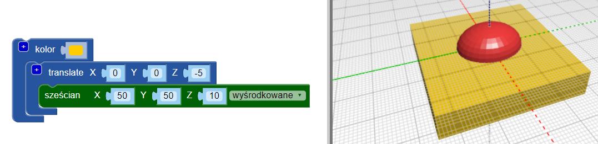
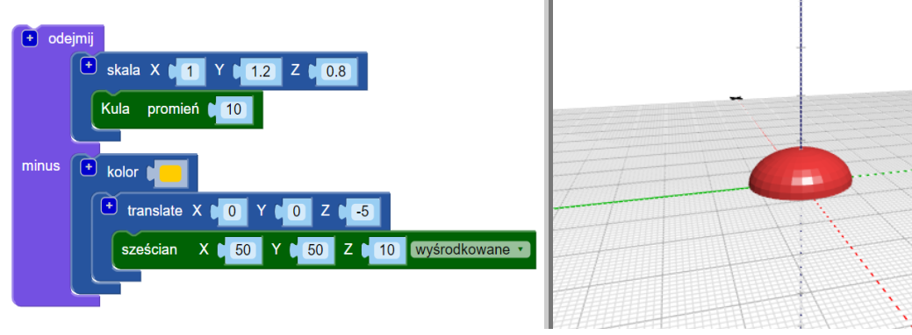

## Spłaszcz podstawę tułowia

Teraz spłaszcz podstawę tułowia, aby twój żuk był bardziej realistyczny. Model z płaską podstawą jest również łatwiejszy do wydrukowania w 3D!

Aby to zrobić, możesz po prostu usunąć prostopadłościan ze swojego modelu, używając bloku `różnica(ang. difference)`{:class="blockscadsetops"}.

--- task ---

Aby rozpocząć, stwórz prostopadłościan, aby zakryć dolną połowę owada (część, która znajduje się poniżej 0 na osi Z).

Prostopadłościan powinien mieć być `wyśrodkowany(ang. centered)` i wysoki na 10 mm (wzdłuż osi Z).

Dodaj blok `przenieś(ang. translate)` blok, aby przesunąć prostopadłościan -5 mm wzdłuż osi Z (w dół).

Aby ułatwić odróżnienie prostopadłościanu i ciała robaka od siebie, dodaj blok `kolor(ang. color)`, aby prostopadłościan miał inny kolor.

Prostopadłościan jest większy niż ciało owada. Oznacza to, że możesz dodawać do żuka bez konieczności późniejszego powiększania prostopadłościanu.

--- /task ---

--- task ---

Użyj bloku `difference`{:class="blockscadsetops"}, aby usunąć przestrzeń zajmowaną przez prostopadłościan z ciała żuka.

Teraz ciało twojego owada ma płaską podstawę!

Przeciągnij model w przeglądarce, aby zobaczyć go pod różnymi kątami.

--- /task ---

  
