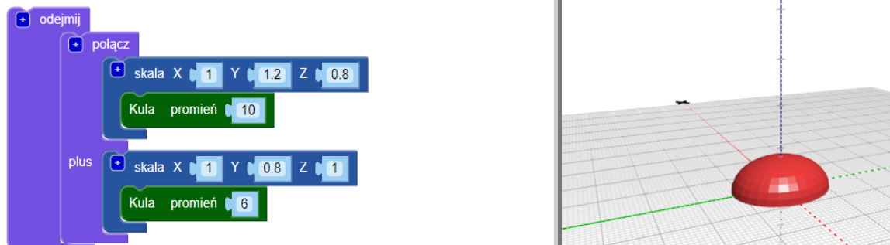
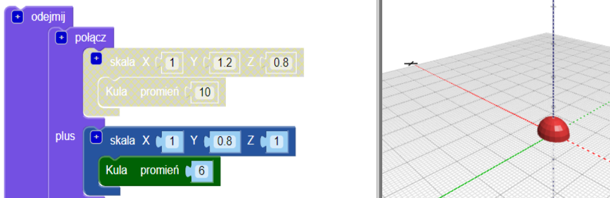
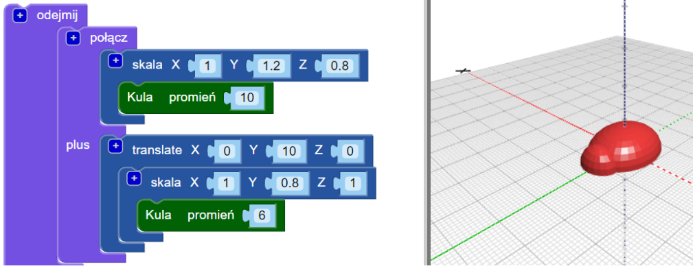
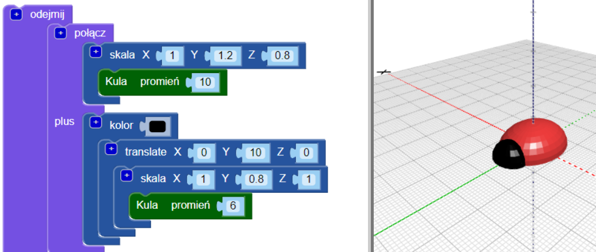
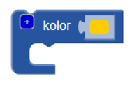
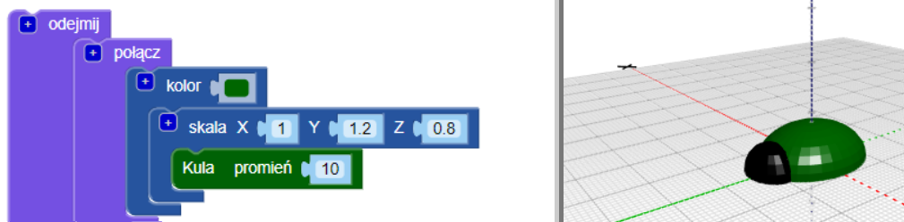

## Dodaj głowę do swojego żuczka

Teraz stwórz głowę żuka.

--- task ---

Dodaj mniejszą `sferę` jako głowę robaka. W tej chwili nie możesz zobaczyć tej nowej sfery, ponieważ jest ona ukryta w tułowiu.

Dodaj również blok `skaluj` do nowej `sfery` aby ukształtować głowę.

Następnie dodaj blok `połącz(ang. union)`{:class="blockscadsetops"}, aby połączyć głowę z tułowiem.

--- /task --- --- task ---

Jeśli chcesz zobaczyć nową `sferę`, tymczasowo wyłącz tułów, klikając prawym przyciskiem myszy jego bloku `scale`{:class="blockscadtransforms"} i wybierając **Wyłącz blok(ang. Disable block)**. Następnie ten blok i pozostałe znajdujące się w nim są wyszarzone, a tułów nie pojawia się po kliknięciu **Render**.

Kliknij blok ponownie prawym przyciskiem myszy i wybierz **Włącz blok(ang. Enable block)** aby włączyć tułów.

--- /task --- --- task ---

`Przenieś` głowę wzdłuż osi Y, aby wystawała z ciała.

  

--- /task --- --- task ---

Jeśli chcesz wyraźnie widzieć różne kształty, zmień kolor głowy.

Możesz także eksperymentować z różnymi kombinacjami kolorów do ozdabiania wydrukowanego żuka permanentnymi pisakami.

--- /task --- --- task ---

Czy możesz zmienić kolor tułowia swojego modelu owada? Możesz zmienić go na kolor filamentu, którym chcesz go wydrukować, lub na kolor permanentnego pisaka, którym chcesz go pokolorować.

--- hints --- --- hint ---

To jest blok, którego potrzebujesz.

--- /hint ---

--- hint ---

Oto przykład z zielonym tułowiem:

--- /hint --- --- /hints --- --- /task ---

  
