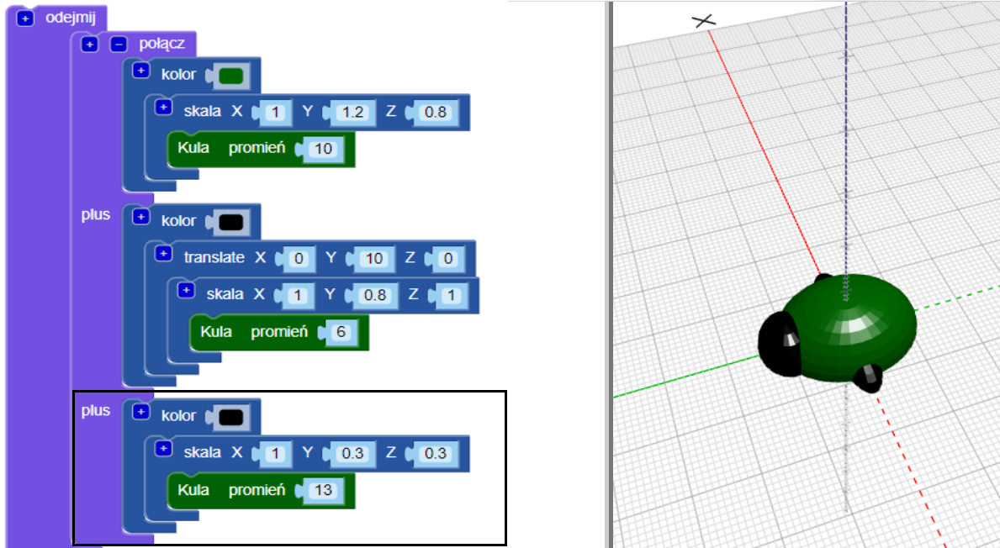
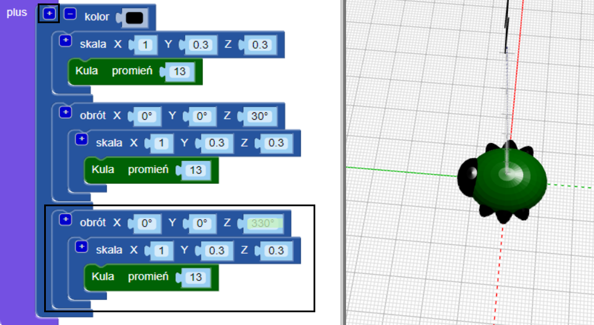

## Stwórz nogi

Teraz żuk potrzebuje aż sześciu nóg!

--- task ---

Najpierw umieść parę nóg pośrodku tułowia owada.

Kliknij `+` u góry bloku `union`, aby dodać kolejną sekcję. Dodaj rozciągniętą `sferę` aby stworzyć parę nóg.

--- /task ---

--- task ---

Jeśli chcesz, możesz wyłączyć tułów żuka, aby zobaczyć, jak powstają nogi.

Następnie ponownie włącz tułów, aby kontynuować pracę nad żukiem.

--- /task ---

--- task ---

Teraz dodaj kolejną parę nóg.

Dodaj kolejną `skalowaną` `sferę` z tymi samymi ustawieniami. Następnie `obróć (ang. rotate)` o `30` stopni wzdłuż osi Z, tak aby nogi wystawały pod kątem.

Teraz twój żuk ma dwie środkowe nogi oraz po jednej przedniej i tylnej nodze!

--- /task ---

--- task ---

Czy możesz dodać trzecią parę nóg, aby żuk miał trzy całe pary nóg?

Twój owad musi wyglądać następująco:

--- hints ---
 --- hint ---

Musisz dodać trzecią `skalowaną` `sferę`.

`Rotate`{:class="blockscadtransforms"} w przeciwnym kierunku do drugiej `sfery`. W okręgu jest 360 stopni.

Oto bloki, których potrzebujesz:

--- /hint ---

--- hint ---

Oto kod, którego potrzebujesz:

--- /hint ---

--- /hints --- --- /task ---