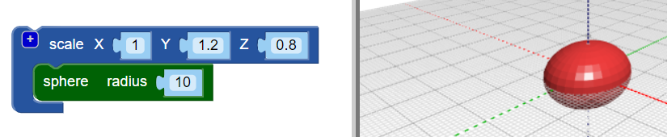

## Dê um corpo ao seu inseto

--- task ---

Abra o editor BlocksCAD em um navegador da web [blockscad3d.com/editor/](https://www.blockscad3d.com/editor/){:target="_blank"}

--- /task ---

Agora crie o corpo do seu inseto.

--- task ---

Comece com o bloco `sphere` com um raio(radius) de `10` (a unidade aqui é milímetros):

Clique no botão **Render** para ver o resultado.

Dica: Você pode alterar a cor do modelo renderizado clicando no ícone colorido.

--- /task --- --- task ---

Agora estique a esfera ao longo do seu eixo Y para criar um corpo alongado para o inseto.

O bloco `scale`{:class="blockscadtransforms"} permite esticar ou achatar objetos ao longo dos eixos X, Y e Z. Defina o valor Y como `1.2` para esticar a esfera ao longo do eixo Y.

Clique em **Render** novamente e verifique se a esfera foi esticada em um elipsoide. Olhe para o seu modelo de diferentes ângulos para poder ver como ele mudou.

--- /task ---

Dica: sempre que você fizer uma alteração no código, clique em **Render** para ver os resultados.

--- task ---

Agora achate o elipsoide um pouco ao longo do eixo z para criar um inseto mais plano.

Definir um valor de eixo abaixo de `1` diminui o objeto ao longo desse eixo. Portanto, altere o valor Z no bloco `scale`{:class="blockscadtransforms"} para `0.8`.

--- /task ---

